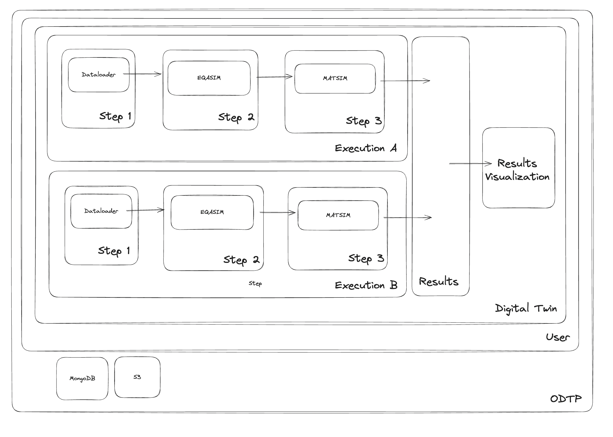

# ODTP Digital Twin 

ODTP is an agnostic platform compatible with digital twins of any kind. To make this possible, we offer solutions to design, manage, and run the different parts of your digital twin.

## What's an ODTP Digital Twin?

In ODTP, a user can generate a Digital Twin entry. This digital twin will consist of multiple executions that involve a workflow of ODTP-compatible components. The results of these executions will be compiled and made available for further analysis or visualization.

This figure represent a Digital Twin with two executions and three steps each.

### Execution 

An execution is the minimal timestep that a digital twin requires. Depending on the digital twin, this could be a one-year simulation, a region of interest, or any other set of boundary conditions. The only requirement is that the components should be compatible with these conditions.

The user will need to define the execution by defining a workflow involving input/output operations across a selection of ODTP components. In `ODTP v0.2.0`, we only offer compatibility with sequential workflows, defined as a list of components in order. The output of one component run will be provided as input to the next component. 

Alternatively, we are working on components that are persistent and can be used via an API. This will increase performance when running several executions involving the same components. 

#### Step

A step is the minimal unit of an execution. Currently, a step consists of a component run with a specific set of parameters and input files. These steps are implemented in Docker images that transform the data from the input folder to the output folder. 

### Results

Some step outputs can be collected and arranged as results. These special outputs will be considered in later stages for multi-execution analysis or data visualizations. 

## Considerations for Designing a Pipeline with `ODTP v0.2.x`

One of the limitations in `ODTP v0.2.x` is that we only offer compatibility with sequential workflows. However, if your pipeline involves loading multiple data inputs into a single step, you can solve this by adding all of them sequentially and activating the environment variable `TRANSFER_INPUT_TO_OUTPUT=TRUE` in the dataloaders. This will transfer the input from one dataloader to the next, accumulating all inputs for the analytical component. 

## `odtp-compose.yml`

The goal of ODTP is to prioritize the flexibility and independence of the Digital Twins generated. That's why we are developing the exporting of each digital twin into an `odtp-compose.yml` file that can be executed directly by Docker. This file will offer the user the possibility to run one specific execution in an isolated and reproducible environment, ensuring consistency across different executions and facilitating collaboration and sharing among users. The `odtp-compose.yml` will include definitions for all the services involved in the execution, their configuration, inter-service dependencies, and any necessary environment variables or volume mounts.

