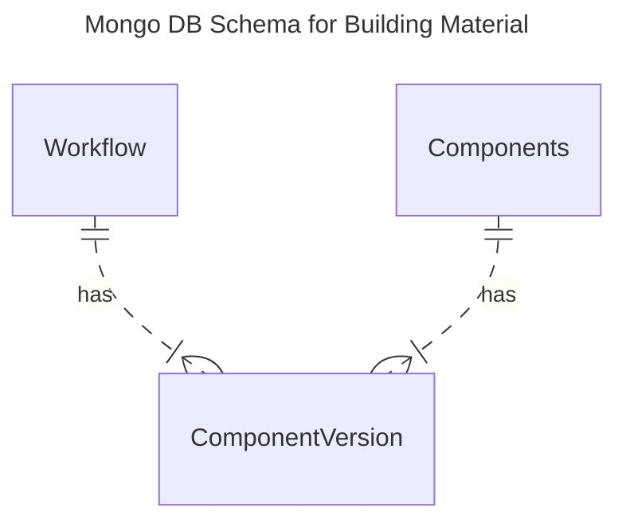
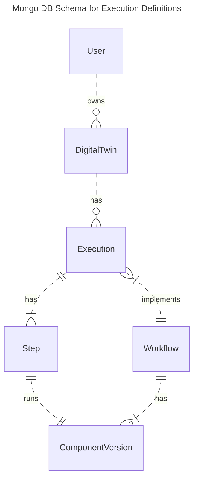
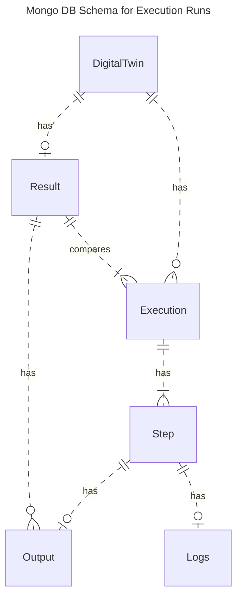

# MongoDB Schema

The operational metadata of ODTP is stored in a MongoDB. In this section the schema of the MongoDB is explained by differentiating between the following parts:

- building material in ODTP: Components and Component Versions
- registration of Executions
- running of Executions

## ER Diagram for building material:

The first ER diagram describes all mongodb collections that relate to building executions, these can also be found in the [ODTP Zoo](../zoo/index.md) and are shared building blocks that are not owned by a user:

- A **Component** corresponds to a tool and there is usually a github repository for each component
- A **ComponentVersion** is a tagged version of the Component in its github repository
- A **Workflow** has multiple Component Versions in a field `versions`: the sequence matters. Currrently only linear workflows are possible with some tweaks, but supporting acyclic graphs is on the [roadmap](roadmap.md)



Components have several Versions. Component Versions can be used to build Workflow, that can then be executed as Executions.

## ER Diagram for the registration of executions:

The second ER diagram describes all mongodb collections that relate to the registration of an execution before it is run:

- A **User** can have zero or more DigitalTwins
- A **DigitalTwin**: Digital Twins are the projects of ODTP. These project are owned by users. A Digital Twin can have zero or more Executions
- An **Execution**: is a Workflow with Configuration and Run time. It consists of multiple Steps
- A **Step** corresponds to exactly one Version of a Component in the Workflow. ODTP builda a Docker image for that step and runs it as a Docker container




## ER Diagram for running executions

The third ER diagram describes all mongodb collections that relate to the running of an execution:
These collection capture the output of the execution run

- A **DigitalTwin** can have zero or more Executions
- An **Execution** can have one or more Steps
- A **Step** has zero or one Output: Outputs are Outputs of a Step. Some steps don't have outputs, see [component types](../components/types.md)
- An **Output** links to an output snapshot on S3
- An **Logs**: logs can optionally stored in the database
- A **Result**: Result is a shared results of a Digital Twin that combines outputs of several executions



## Current MongoDB Schema

### Users

``` json
users = {
    "_id": ObjectId(),
    "displayName": "John Doe",
    "email": "john@example.com",
    "github": "johnDoeRepo",
    "created_at": datetime.utcnow(),
    "updated_at": datetime.utcnow(),
    "digitalTwins": [ObjectId()],
    "deprecated": false,
}
```

### Digital Twins

``` json
digitalTwins = {
    "_id": ObjectId(),
    "userRef": ObjectId(),
    "name" : "title",
    "status": "active",
    "public": True,
    "created_at": datetime.utcnow(),
    "updated_at": datetime.utcnow(),
    "executions": [ObjectId()],
    deprecated: false
}
```

### Components

[Components](../components/index.md) are the building blocks of ODTP that correspond to github repos

``` json
components = {
    "_id": ObjectId(),
    "author": "Test",
    "componentName": "ComponentX",
    "repoLink": "https://github.com/odtp-org/odtp-component-example",
    "status": "active",
    “type”: “persistent”,
    "description": "Description for ComponentX",
    "tags": ["tag1", "tag2"],
    "created_at": datetime.utcnow(),
    "updated_at": datetime.utcnow(),
    "versions": [ObjectId()] # 1:n relationship with components,
    deprecated: false
}
```

### Component Versions

Component versions get their properties from [`odtp.yml`](../components/develop.md#step-4-provide-metadata-for-the-component) and contain default values for the executions.

```json
versions = {
    "_id": ObjectId(),
    "Component”: # n:1 relationship with components
      “ComponentId": ObjectId(),
      "componentName": "ComponentX",
      "repoLink": "https://github.com/odtp-org/odtp-component-example",
      “type”: “persistent”,
    }
    "version": "v1.0",
    "component_version": "1.0.0",
    "commitHash": "6471218336ce7de41a5162c9556c0ff68f9ec13c",
    "parameters": {},
    "title": "Title for Version v1.0",
    "description": "Description for Version v1.0",
    "tags": ["tag1", "tag2"],
    "created_at": datetime.utcnow(),
    "updated_at": datetime.utcnow(),
    "odtp_version": '0.5.0',
    "deprecated": false,
    "imageLink":  "https://hub.docker.com/...",
    "description": "description from odpt.yml",
    “type”: “persistent”,
    "paramters": [],
    "tags": [],
    "tools": [],
    "licence": 'AGPL-3.0',
    "ports": [],
    "secrets": [],
    "devices": [],
    "data-inputs": null,
    "data-outputs": null,
    "build-args": null
}
```

### Executions

* `dt_id` is the reference to the Digital Twin.
* `deprecated` is a logical delete: the execution will no longer be listed in the GUI.
* `workflow_id` is the reference to the Workflow

```json
executions = {
    "_id": ObjectId(),
    "dt_id": ObjectId(),
    "title": "Title for Execution",
    "description": "Description for Execution",
    "tags": ["tag1", "tag2"],
    "workflowSchema": {
        "workflowExecutor": "barfi",
        "workflowExecutorVersion": "v2.0",
        "component_versions": [{"version": ObjectId()}],
        "WorkflowExecutorSchema": [],
    },
    "start_timestamp": datetime.utcnow(),
    "end_timestamp": datetime.utcnow(),
    "createdAt": datetime.utcnow(),
    "updatedAt": datetime.utcnow(),
    "steps": [ObjectId()],
    "deprecated": false,
    " workflow_id": ObjectId(),
    "execution_path": '/usr/path/to/execution/directory`
}
```

### Steps

A Step is a step that was run in an execution.

* The field `outputs` is currently not used, instead the output of a step is a 1-1 relationship and the reference can be found in the `output` property.

* `error` and `msg` will only be filled in case the step errored on its last run. Then it contains the exit message from the docker run command.

* `secrets` may contain the filename to the encrypted file on the server where the secrets for the step are stored

* `run_step` determines whether the step will run on the next  execution run. It is possible to partially rerun executions, see [tutorial](../tutorials/run-executions.md)

```json
steps = {
    "_id": ObjectId(),
    "executionRef": ObjectId(),  # Reference to an executions
    "timestamp": datetime.utcnow(),
    "start_timestamp": datetime.utcnow(),
    "end_timestamp": datetime.utcnow(),
    "createdAt": datetime.utcnow(),
    "updatedAt": datetime.utcnow(),
    "type": "interactive" or "ephemeral",
    "logs": [],
    "inputs": {},
    "outputs": {},
    "secrets": [],
    "run_step": true,
    "error": false,
    "msg": null,
    "component_version": ObjectId(),
    "parameters": {},
    "output": ObjectId(),
}

### Outputs

Outputs are the output of a step in an execution run. Outputs are stored on S3 and also in a zipped form in the execution project directory.

```json
outputs = {
    "_id": ObjectId(),
    "stepRef": ObjectId(), # reference to a step,
    "output_type": "snapshot" or "output",
    "s3_bucket": "bucket_name",
    "s3_key": "path/to/output",
    "file_name": "output_file_name",  # The name of the file in the output
    "file_size": 123456,  # Size of the file in bytes
    "file_type": "image/jpeg",  # MIME type or file type
    "created_at": datetime.utcnow(),  # Timestamp when the output was created
    "updated_at": datetime.utcnow(),
    "metadata": {  # Additional metadata associated with the output
        "description": "Description of the output",
        "tags": ["tag1", "tag2"],
        "other_info": "Other relevant information"
    },
    "access_control": {  # Information about who can access this output
        "public": False,  # Indicates if the output is public or private
        "authorized_users": [ObjectId()],
    }
}
```

### Logs and Results

* Logs can optionally stored in the database by the `odtp_component_client`. We don't recommend this, since it can spam the mongoDB quickly.

* Results are not yet implemented in ODTP.

