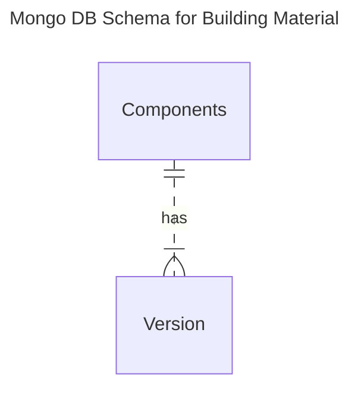
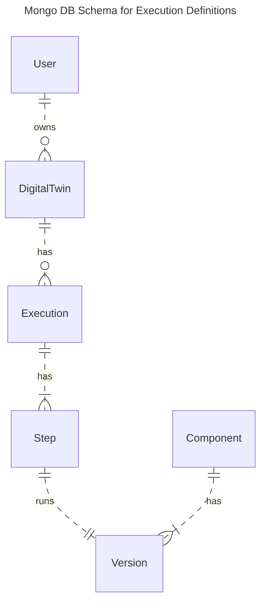
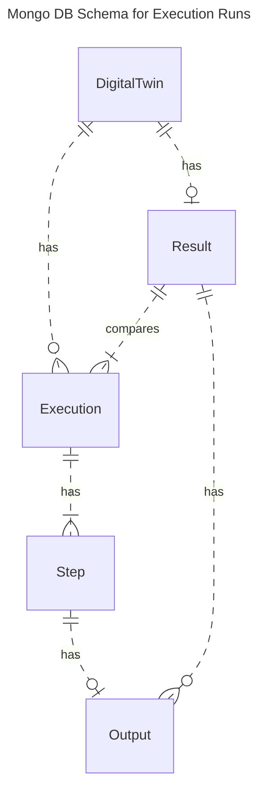

# MongoDB Schema

The operational metadata of ODTP is stored in a MongoDB. In this section the schema of the MongoDB is explained by differentiating between the following parts:

- building material in ODTP: Components and Component Versions
- registration of Executions
- running of Executions

## ER Diagram for building material:

The first ER diagram describes all mongodb collections that relate to building executions, these can also be found in the [ODTP Zoo](../zoo/index.md):

- A **Component** can have one or more Versions
- A **Version** is a tagged version of the Component in its github repo.



Components have several Versions. Components can be used to build Workflow, that can then be executed as Executions. Workflows are not yet registered in ODTP, but might be so in future releases, see our [Roadmap](roadmap.md).

## ER Diagram for the registration of executions:

The second ER diagram describes all mongodb collections that relate to the registration of an execution before it is run:

- A **User** can have zero or more DigitalTwins: Digital Twins are the projects of ODTP. These project are owned by users
- A **DigitalTwin** can have zero or more Executions: Executions are Executions of Workflows that consist on Components
- An **Execution** can have one or more Steps: each step corresponds to exactly one Component and runs a Version of that component as a Docker Container
- A **Step** corresponds to exactly one Version of a Component. ODTP build a Docker image for that step and runs it as a Docker container 




## ER Diagram for running executions

The third ER diagram describes all mongodb collections that relate to the running of an execution:
These collection capture the output of the execution run

- A **DigitalTwin** can have zero or more Executions
- An **Execution** can have one or more Steps
- A **Step** has zero or one Output: Outputs are Outputs of a Step. Some steps don't have outputs, see [component types](../components/types.md)
- A **Result** has zero or more Outputs: Results are shared results of a Digital Twin
- A **Result** belongs to a DigitalTwin
- A **Result** combines outputs of several Executions



## Complete current schema

!!! warning end "Under Construction"

    The mongodb schema is still under construction and will be refactored in an upcoming release. In the current schema the result is implemented as belonging to a single execution in contradiction to the schema as explained above.

``` json
users = {
    "_id": ObjectId(),
    "displayName": "John Doe",
    "email": "john@example.com",
    "github": "johnDoeRepo",
    "created_at": datetime.utcnow(),
    "updated_at": datetime.utcnow(),
    "digitalTwins": [ObjectId()]  
}

digitalTwins = {
    "_id": ObjectId(),
    "userRef": ObjectId(),
    "name" : "title",
    "status": "active",
    "public": True,
    "created_at": datetime.utcnow(),
    "updated_at": datetime.utcnow(),
    "executions": [ObjectId()] 
}

``` json
components = {
    "_id": ObjectId(),
    "author": "Test",
    "componentName": "ComponentX",
    "repoLink": "https://github.com/odtp-org/odtp-component-example",
    "status": "active",
    "title": "Title for ComponentX",
    “type”: “persistent”, 
    "description": "Description for ComponentX",
    "tags": ["tag1", "tag2"],
    "created_at": datetime.utcnow(),
    "updated_at": datetime.utcnow(),
    "versions": [ObjectId()] # 1:n relationship with components  
}

versions = {
    "_id": ObjectId(),
    "Component”: # n:1 relationship with components 
      “ComponentId": ObjectId(),
      "componentName": "ComponentX", 
      "repoLink": "https://github.com/odtp-org/odtp-component-example",
      “type”: “persistent”,
    } 
    "version": "v1.0",
    "component_version": "1.0.0",
    "commitHash": "6471218336ce7de41a5162c9556c0ff68f9ec13c",
    "dockerHubLink": "https://hub.docker.com/...",
    "parameters": {},
    "title": "Title for Version v1.0",
    "description": "Description for Version v1.0",
    "tags": ["tag1", "tag2"],
    "created_at": datetime.utcnow(),
    "updated_at": datetime.utcnow()
}

executions = {
    "_id": ObjectId(),
    "digitalTwinRef": ObjectId(), 
    "title": "Title for Execution",
    "description": "Description for Execution",
    "tags": ["tag1", "tag2"],
    "workflowSchema": {
        "workflowExecutor": "barfi",
        "workflowExecutorVersion": "v2.0",
        "component_versions": [{"version": ObjectId()}],
        "WorkflowExecutorSchema": {}
    },
    "start_timestamp": datetime.utcnow(),
    "end_timestamp": datetime.utcnow(),
    "steps": [ObjectId()]
}

steps = {
    "_id": ObjectId(),
    "executionRef": ObjectId(),  # Reference to an executions
    "timestamp": datetime.utcnow(),
    "start_timestamp": datetime.utcnow(),
    "end_timestamp": datetime.utcnow(),
    "type": "interactive" or "ephemeral",
    "logs": [{
        "timestamp": datetime.utcnow(),
        "type": "DEBUG",
        "logstring": "Test log"
    }],
    "inputs": {},
    "outputs": {},
    "component_version": ObjectId() # 1:1 reference to a version
    "parameters": {},
    "output": ObjectId() 1:1 reference to an output
}

output = {
    "_id": ObjectId(),
    "stepRef": ObjectId(), # reference to a step,      
    "output_type": "snapshot" or "output",
    "s3_bucket": "bucket_name",      
    "s3_key": "path/to/output",  
    "file_name": "output_file_name",  # The name of the file in the output
    "file_size": 123456,  # Size of the file in bytes
    "file_type": "image/jpeg",  # MIME type or file type
    "created_at": datetime.utcnow(),  # Timestamp when the output was created
    "updated_at": datetime.utcnow(),      
    "metadata": {  # Additional metadata associated with the output
        "description": "Description of the output",
        "tags": ["tag1", "tag2"],
        "other_info": "Other relevant information"
    },
    "access_control": {  # Information about who can access this output
        "public": False,  # Indicates if the output is public or private
        "authorized_users": [ObjectId()],      
    }
}

results = {
    "_id": ObjectId(),
    "executionRef": ObjectId(), # reference to an execution,
    "digitalTwinRef": ObjectId(),  # reference to the digitalTwin
    "output": [ObjectId()], # reference to an output,
    "title": "Title for Result",
    "description": "Description for Result",
    "tags": ["tag1", "tag2"],
    "created_at": datetime.utcnow(),
    "updated_at": datetime.utcnow(),
}
```
