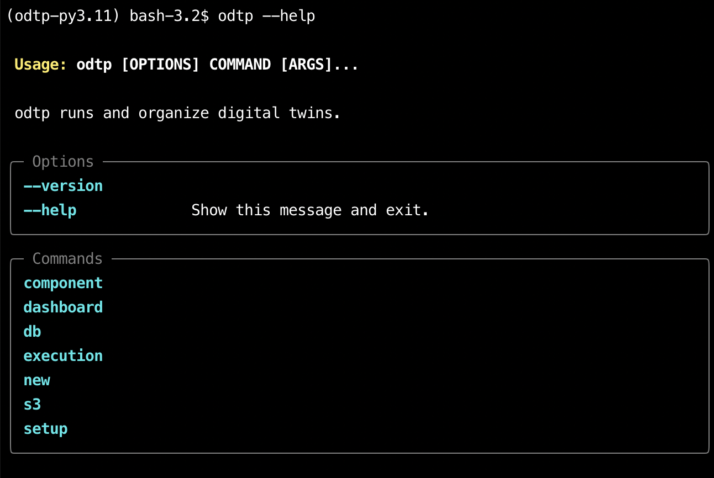

# Commandline Tutorial

ODTP can also be used via the commandline interface:

## Getting Started

If you are using poetry, you can go to `odtp` folder and run `poetry shell`. This will load the environment with all dependencies.

On the other hand, if you are using the `docker-compose` solution you can just run `odtp` command directly.

``` sh
odtp --help
```

So you can start working:

{ width="800" }

## Component Versions

Component Versions are the building blocks in ODTP: they are used in [Workflows](#workflows) and [Executions](#executions)

* you need the github repository url
* you also need a version tag for the version you want to add
* the github repository needs to be an ODTP component with a valid [`odtp.yml`](../components/odtp-yml.md) file

``` sh
odtp new odtp-component-entry \
--component-version v0.1.1 \
--repository https://github.com/odtp-org/odtp-component-example
```

You should see this output:

```sh
A component version has been added
component_id_: 65c3ab02b4afbca32db08738
version_id_: 65e00bc02c01a56f2b8c95f9
```

## Workflows


## Users

So the first thing you need is a user:

* the username must be unique
* `github` should be your valid github username
* `email` should be your email

Both `name` and `email` are used for identification in later steps.

``` sh
odtp new user-entry \
--name Max \
--email max@mail.com \
--github max
```

The output should looks like:
```
A user has been added: 65c3ab02b4afbca32db08738
```

## Digital Twins

In the CLI you need the `user-id` from the previous step or the user email to add a digital twin:

```sh
odtp new digital-twin-entry \
--user-id 65c3ab02b4afbca32db08738 \
--name example
```

You can also use the user email to identify the user, that the digital twin belongs to

```sh
odtp new digital-twin-entry \
--user-email max@mail.com \
--name example
```

The output should looks like:
```
A digital twin has been added: 65a7c735732ae1d3fee2b946
```

## Executions

A set of parameters is a file containing all the variables needed to run that component.

```
DATASET=rf3
CATEGORY=Health
BATCH_SIZE=100
```

The components tags are formed by component name and version tag from github:

```sh
odtp new execution-entry \
--digital-twin-name example-workflow \
--name execution-example \
--component-tags odtp-dataloader:v1.0.1,odtp-data-dashboard:v1.2.0 \
--parameter-files /path/params1,path/params2 \
--ports 80:80,8501:8501+80:80
```
```
execution_id: 65c3ab980c57d37eb076b6ba
step_ids 65c3ab980c57d37eb076b6bb, 65c3ab980c57d37eb076b6bc
```

## Run Executions

An execution consists of components and can have extra port mappings and parameters.

- `digital-twin-id` (Optional): Obtained before. Alternatively, you can use the name of the digital twin.
- `digital-twin-name` (Optional): Name of the digital twin. Alternatively, you can use the `digital-twin-id`.
- `name`: A name for the execution
- `component-tags`: All components tags (`componentA:v0.1.0`) involved in the workflow aligned sequentially and separated by commas.
- `parameter-files`: Parameters files separated by commas.
    - This file should contain all parameters used like in a dotenv file format.
- `ports`: Ports matching used by the containers.
    - Components ports should be separated by `,`. i.e. `8763:3000,8501:8501`
    - Place as many `,` as connections between components (steps). If ports are not being used in the first, and second component: i.e. `,,8501:8501`
    - If multiple ports are being use in the same step please use `+`: i.e. `,,8501:8501+3000:3000`


- [dt-example workflow](https://github.com/odtp-org/dt-example)
- [dt-corsica-mobility](https://github.com/odtp-org/dt-corsica-mobility)

## Get Documents from the MongoDB

On the command you can only list all executions in json for a digital twin by running:

```sh
odtp db executions_for_digitalTwin \
--dt-id 65c3ab02b4afbca32db08738
```

## Prepare and run an execution

Please refer to section [Run Executions](https://odtp-org.github.io/odtp-manuals/tutorials/run-executions/)

Prepare the execution. This will generate all the folder structure and build all necesary docker images for our digital twin. From `v0.4.0` odtp will check for available images before building, if no image is available then the repository will be pulled and the docker image will be built. 

An empty folder must be provided to generate the data folder required, and we recommend placing it in a preconfigured digital twin folder. 

``` sh
odtp execution prepare \
--execution-name execution-example \
--project-path /path/execution
```

A normal preparation looks like this:

``` sh
INFO (21/12/2023 02:53:02 PM): Connected to: <odtp.db.MongoManager object at 0x138546950> (LineL 22 [initial_setup.py])
INFO (21/12/2023 02:53:03 PM): Connected to: <odtp.db.MongoManager object at 0x12eca4110> (LineL 22 [initial_setup.py])
INFO (21/12/2023 02:53:03 PM): Connected to: <odtp.db.MongoManager object at 0x138530bd0> (LineL 22 [initial_setup.py])
INFO (21/12/2023 02:53:04 PM): Removing all files and directories (LineL 23 [run.py])
INFO (21/12/2023 02:53:04 PM): Downloading repository from https://github.com/odtp-org/odtp-component-example to dt_test/component-example_0.0.1_0/repository (LineL 35 [run.py])
Cloning into 'dt_test/component-example_0.0.1_0/repository'...
remote: Enumerating objects: 65, done.
remote: Counting objects: 100% (65/65), done.
remote: Compressing objects: 100% (42/42), done.
remote: Total 65 (delta 30), reused 52 (delta 18), pack-reused 0
Receiving objects: 100% (65/65), 31.23 KiB | 376.00 KiB/s, done.
Resolving deltas: 100% (30/30), done.
INFO (21/12/2023 02:53:05 PM): Building Docker image component-example_0.0.1 from dt_test/component-example_0.0.1_0/repository (LineL 47 [run.py])

INFO (21/12/2023 03:24:36 PM): COMPONENTS DOWNLOADES AND BUILT (LineL 60 [workflow.py])
```

### run execution

Once your execution is prepared, it's time to run it! When running an execution you can provide some secrets for your components separated by commas (`,`) similar to how you define the pipeline in the execution generation. Secrets files are structure in a similar way to parameters files described in [Executions](https://odtp-org.github.io/odtp-manuals/tutorials/executions/#__tabbed_3_2)

``` sh
odtp execution run \
--execution-name execution-example \
--secrets-files /path/Secrets001,/path/Secrets001 \
--project-path /path/execution
```

# Delete an execution

Excutions and all associated data, such as MongoDB entries, S3 Files, and project path folders can be easily deleted. In `v0.4.0` this feature is only available in the CLI

=== "Command Line CLI"

    ```sh
    odtp execution delete \
    --execution-name execution-example \
    --project-path /path/exeuction
    ```


Existing executions can be selected in order to run them: when you select an execution you see a
button: "PREPARE AND RUN EXECUTION": click on it and you will get to a run page where you can run the
execution: see [run executions](run-executions.md)
