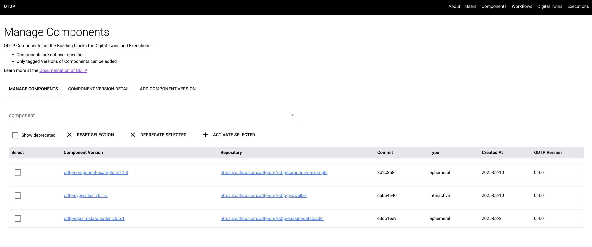
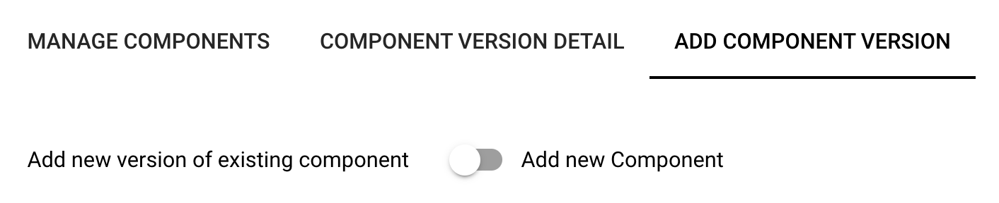
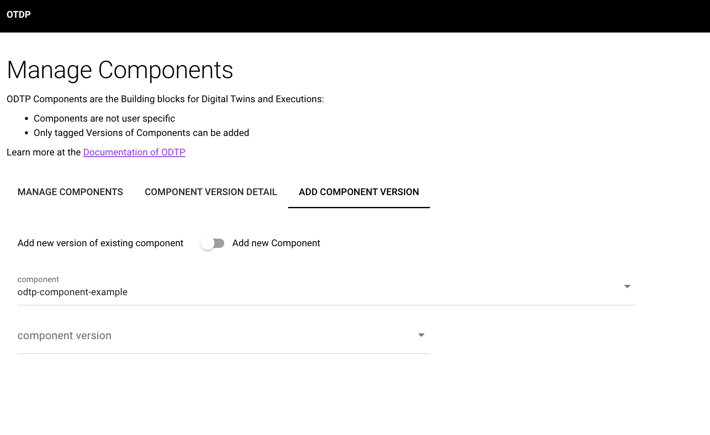
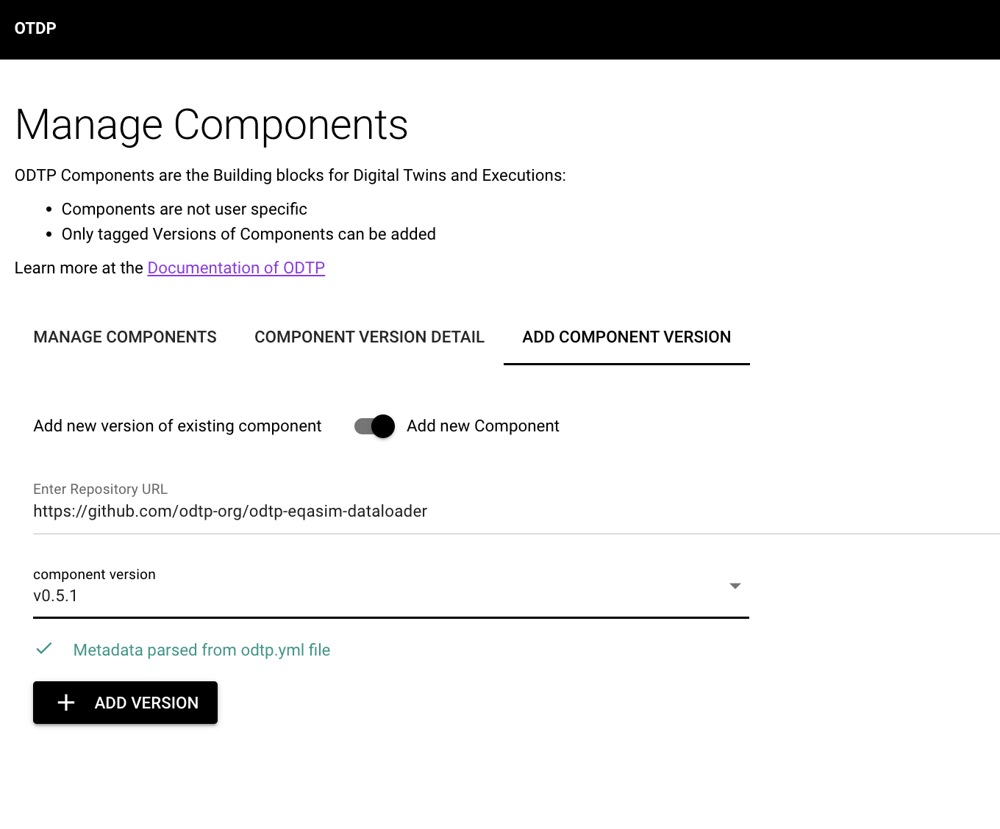
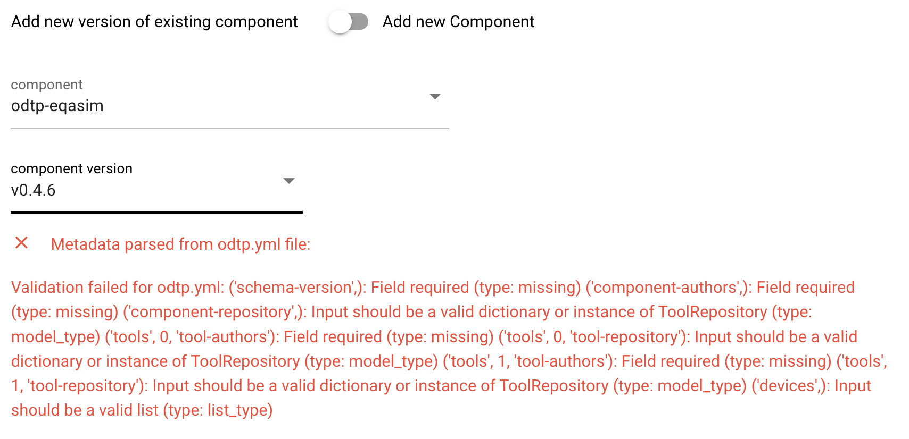
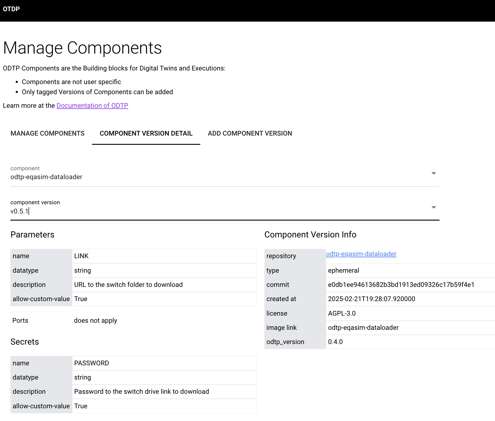

# Components and Versions

!!! note
    - Components are code repositories that wrap tools, see [Components](../components/index.md)
    - Components come with Versions that correspond to tags in the github repository
    - When Component Versions are added then the `odtp.yml` is parsed: it needs to conform to the standards described at [odtp.yml format](../components/odtp-yml.md)
    - The building blocks in ODTP are Component Versions
    - Component Versions can also be added via the [Commandline](command-line.md#component-versions)

## Manage Component Versions

In the Dashboard you can list all Component Versions that are already on ODTP.

* you can deprecate Component Versions
* you can also reactivate them
* you can chose to also show deprecated Component Versions. By default they are not displayed

{ width="800" }

## Add a new component version

In order to start using the components in ODTP you need to add them to the platform. Components are the building block in workflows and executions.

- Components are imported by their github url and Version correspond to the version tags.
- A component repository should have a valid tag in order to be imported.
- A component version also needs to have a valid `odtp.yml`. Otherwise it can not be imported into ODTP: see [odtp.yml specification](../components/odtp-yml.md)

Under the tab "Add Component Version" you can either add a new component with a component version or a new version for an existing component.

{ width="400" }

{ width="800" }

You will see a message when ODTP was able to parse the `odtp.yml` file

{ width="800" }

Error case: `odtp.yml` file could not be parsed:

{ width="800" }

## Component Version Details

The component version gets the default configuration and other metadata from the `odtp.yml` file: you can see this information in the detail tab:

{ width="800" }

## Next add Workflow

Once you have added all the component versions you need, you can combine them into Workflows:

[Workflows](workflows.md){ .md-button }
