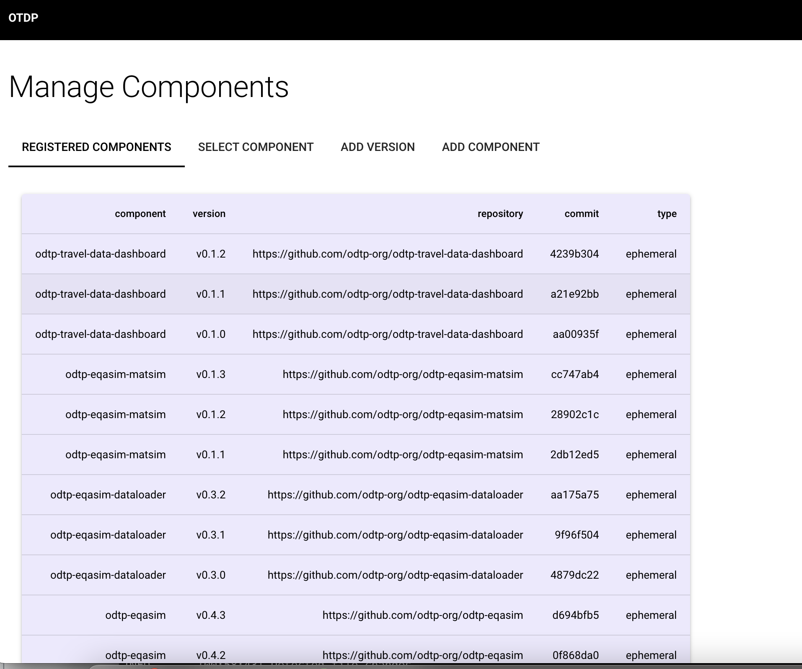
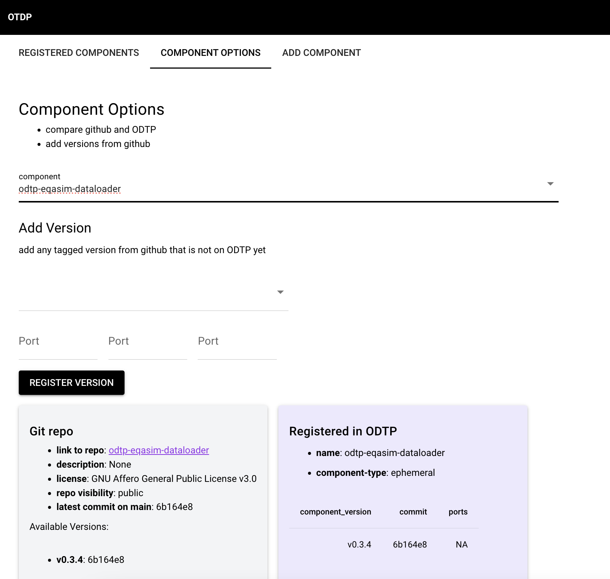

# Components and Versions

!!! note

    - Components are code repos that can be used for digital twin workflows
    - Components can have different versions

## Checkout existing components

=== "Dashboard GUI"
  
    In the Dashboard you can list all components that are already on ODTP. For all these components you can select them in
    the tab "COMPONENT OPTIONS". There you can compare their versions between ODPT and github

    { width="800" }
    { width="800" }

=== "Command Line CLI"

    In the CLI you can get the metadata for a component from the Mongodb:

    ``` sh
    odtp db get --collection components
    ```
    ``` json
    [
        {
            "_id": "66349ff5af3487ca1aace32c",
            "author": "Test",
            "componentName": "odtp-component-example",
            "repoLink": "https://github.com/odtp-org/odtp-component-example",
            "status": "active",
            "title": "Title for ComponentX",
            "type": "ephemeral",
            "description": "Description for ComponentX",
            "tags": [
            "tag1",
            "tag2"
            ],
            "created_at": "2024-05-03 08:27:33.938000",
            "updated_at": "2024-05-03 08:27:33.938000",
            "versions": [
            "66349ff5af3487ca1aace32d"
            ]
        }
    ]
    ```

## Add a new component

Add a component:

- Components are imported by their github url and version tag
- you can specify ports with `--ports`

!!! note

    The component will be represented by the component `name` and the `version tag`. Make sure to name the component in a way that helps to recognize it: best take the github name of the component's repository.

    ``` mermaid
    graph LR
    odtp-component-example:v0.1.0;
    ```

=== "Dashboard GUI"

    { width="800" }

=== "Command Line CLI"

    In the CLI you can add a new component by its version tag:

    ``` sh
    odtp new odtp-component-entry \
    --name component-example \
    --component-version 0.1.0 \
    --repository https://github.com/odtp-org/odtp-component-example
    ```

    Output:

    ```
    A component version has been added
    component_id_: 65c3ab02b4afbca32db08738
    version_id_: 65e00bc02c01a56f2b8c95f9
    ```


## Add a new version for an existing component

Under the tab "COMPONENT OPTIONS" you can also update a component by adding a new version for it from github. 

=== "Dashboard GUI"

    { width="800" }

=== "Command Line CLI"

    ``` sh
    odtp new odtp-component-entry \
    --name component-example \
    --component-version 0.1.1 \
    --repository https://github.com/odtp-org/odtp-component-example
    ```
    ```sh
    A component version has been added
    component_id_: 65c3ab02b4afbca32db08738
    version_id_: 65e00bc02c01a56f2b8c95f9
    ```
