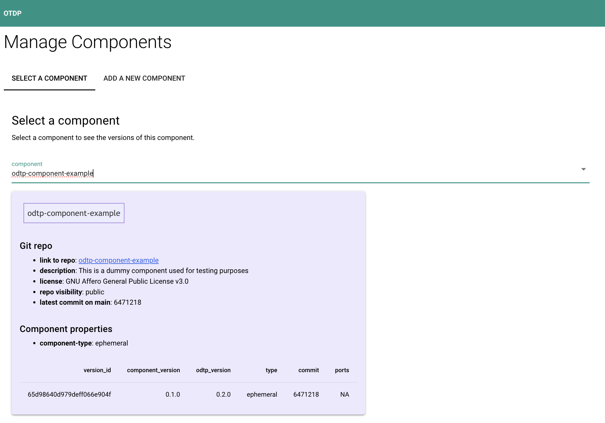
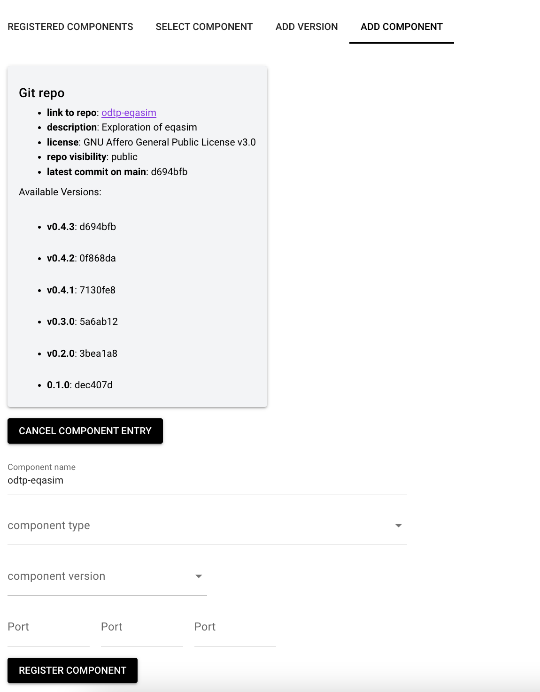
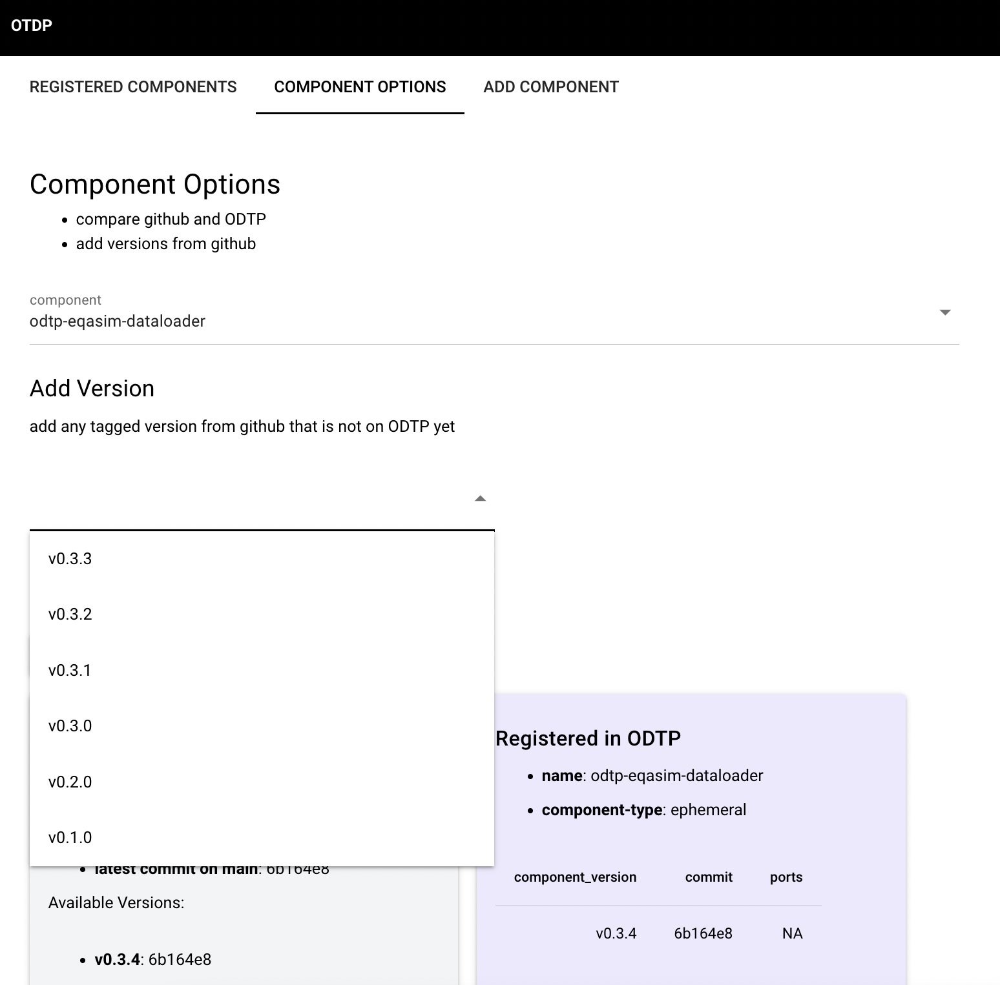

# Components and Versions

!!! note

    - Components are code repos that can be used for digital twin workflows
    - Components can have differen versions

## Checkout existing components

=== "Dashboard GUI"

    { width="800" }

=== "Command Line CLI"

    ``` sh
    odtp db get --collection components
    ```
    ``` json
    [
        {
            "_id": "65dc21a25b16b1fac7334596",
            "author": "Test",
            "componentName": "odtp-eqasim-dataloader",
            "repoLink": "https://github.com/odtp-org/odtp-eqasim-dataloader",
            "status": "active",
            "title": "Title for ComponentX",
            "type": "ephemeral",
            "description": "Description for ComponentX",
            "tags": [
            "tag1",
            "tag2"
            ],
            "created_at": "2024-02-26 05:29:06.729000",
            "updated_at": "2024-02-26 05:29:06.729000",
            "versions": [
            "65dc21a25b16b1fac7334597"
            ]
        }
    ]
    ```

## Add a new component

Add a component:

- by default the latest commit is taken when you create a component but you can provide a specific commit with `--commit` 
- you can specify ports with `--ports`
- the latest `odtp_version` is taken from the [odtp repo](https://github.com/odtp-org), but you can set a different version

!!! note

    The component will be represented by the component `name` and its `component_version`. Make sure that these two attributes are set correctly.

    ``` mermaid
    graph LR
    component-example_0.1.0;
    ```

=== "Dashboard GUI"

    { width="800" }

=== "Command Line CLI"

    ``` sh
    odtp new odtp-component-entry \
    --name component-example \
    --component-version 0.1.0 \
    --repository https://github.com/odtp-org/odtp-component-example
    ```
    ```
    A component version has been added
    component_id_: 65c3ab02b4afbca32db08738
    version_id_: 65e00bc02c01a56f2b8c95f9
    ```


## Add a new version for an existing component

You can update a component by adding a new version for it.
The parameters are the same as for the original adding of the component. When not specified the latest
commit will be taken.

=== "Dashboard GUI"

    { width="800" }

=== "Command Line CLI"

    ``` sh
    odtp new odtp-component-entry \
    --name component-example \
    --component-version 0.1.1 \
    --repository https://github.com/odtp-org/odtp-component-example
    ```
    ```sh
    A component version has been added
    component_id_: 65c3ab02b4afbca32db08738
    version_id_: 65e00bc02c01a56f2b8c95f9
    ```
