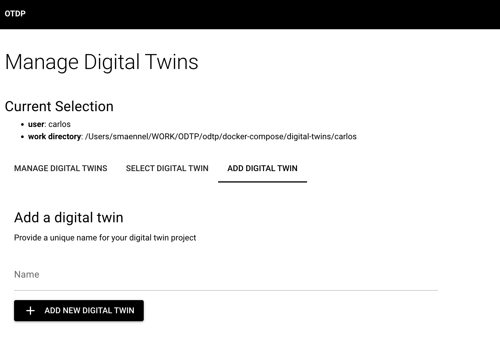

# Users and digital twins

!!! note
    * Digital Twins are the projects: they are owned by a user
    * The digital twin name has to be unique among the digital twins of a user.
    * Some commands have equivalents in the GUI such as the digital twin add command. Others have not.


## Setup a Digital Twin

Once you have a user, you can set up a [digital twin](digital-twins.md)

=== "Dashboard GUI"

    { width="800" }

=== "Command Line CLI"

    In the CLI you need the `user-id` from the previous step:

    ```sh
    odtp new digital-twin-entry \
    --user-id 65c3ab02b4afbca32db08738 \
    --name example
    ```

    You can also use the user email to identify the user, that the digital twin belongs to

    ```sh
    odtp new digital-twin-entry \
    --user-email max@mail.com \
    --name example
    ```

    The output should looks like:
    ```
    A digital twin has been added: 65a7c735732ae1d3fee2b946
    ```

## Select a Digital Twin

Now you can select your digital twin. Once you have selected a digital twin you can set up [executions](executions.md)

{ width="800" }

## Manage Digital Twins

You can also manage your digital twins.

{ width="800" }

## Next Add Executions

Once you have added a Digital Twin you can add Executions:

[Executions](executions.md){ .md-button }
