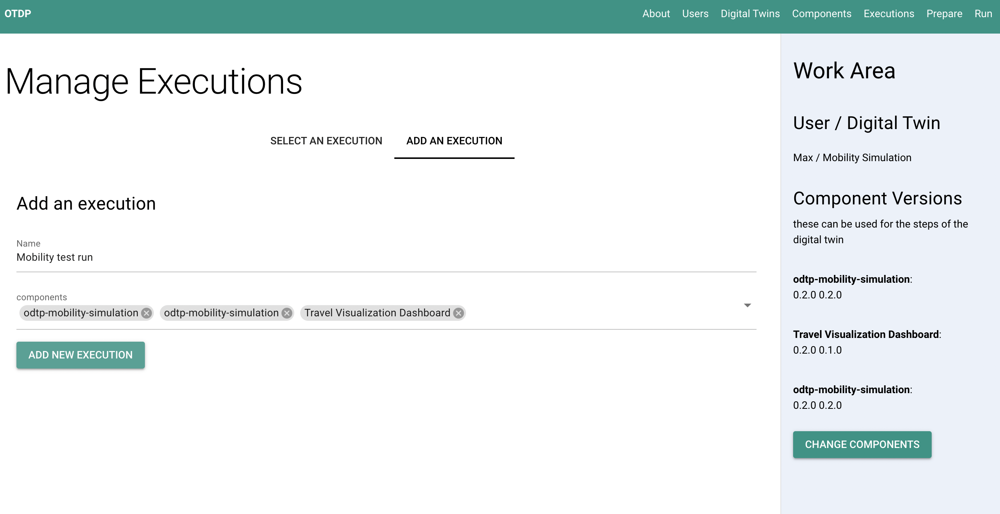
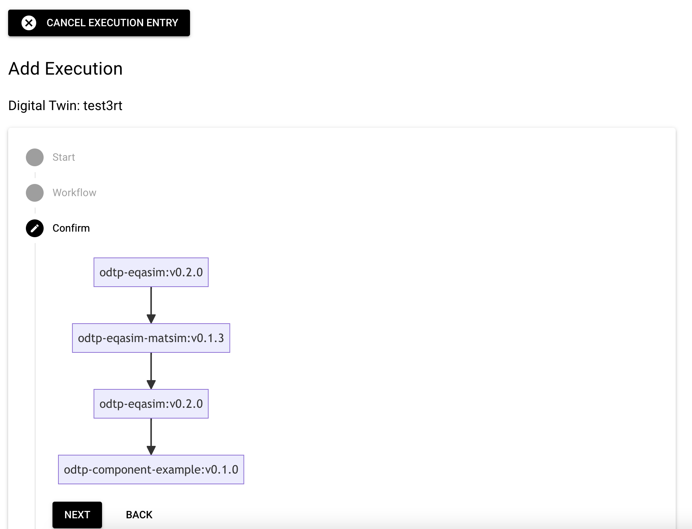
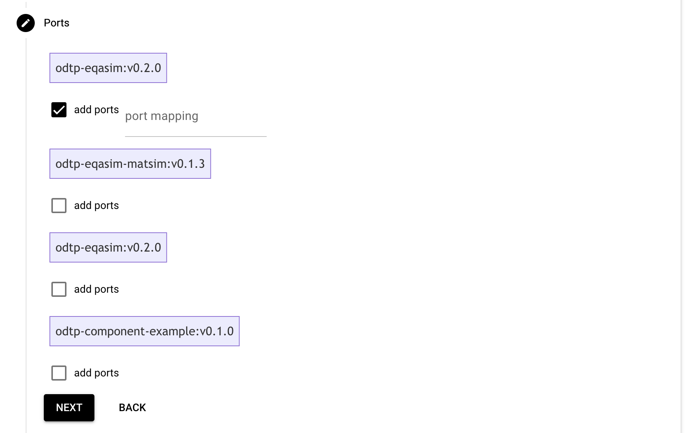
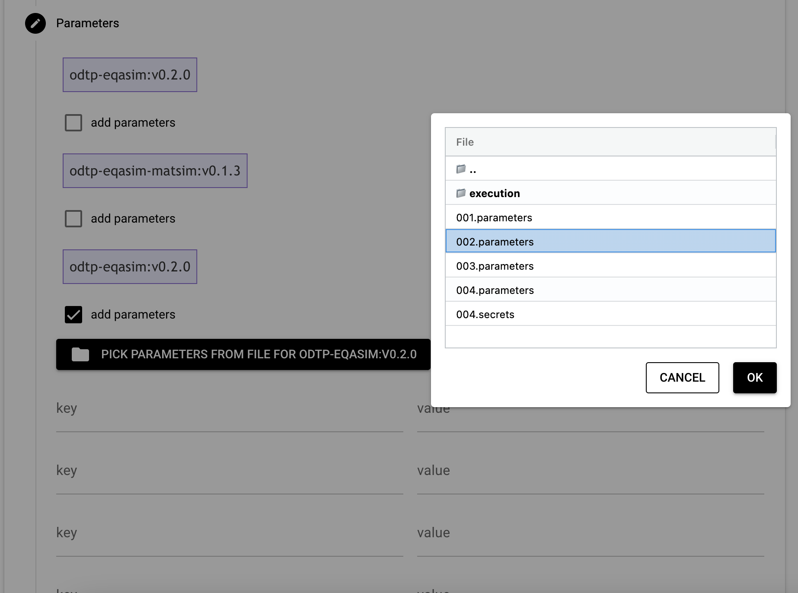
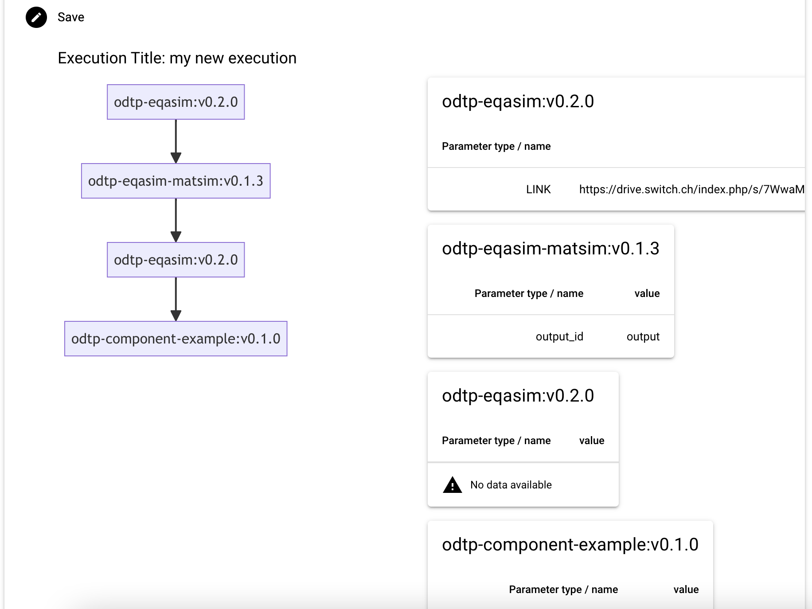
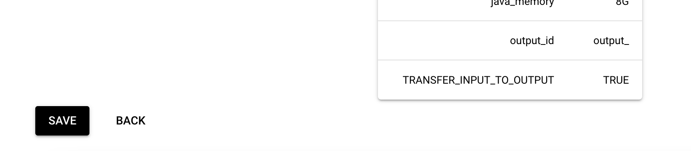

# Executions

!!! note

    - Executions are owned by users and belong to a digital twin
    - Executions consist of components that are run in sequence
    - The output of one component will serve as input to the next component

    ``` mermaid
    graph LR
    component-example_0.1.0 --> travel_dashboard_0.2.1;
    ``` 

## Add an execution

An execution consists of components and can have extra port mappings and parameters.

- `digital-twin-id`: Obtained before. 
- `name`: A name for the execution
- `versions`: All versions involved in the workflow aligned sequentially and separated by commas. 
    - Versions order should match components. 
- `parameter-files`: Parameters files separated by commas.
    - This file should contain all parameters used like in a dotenv file format.
- `ports`: Ports matching used by the containers. 
    - Components ports should be separated by `+`. i.e. `8763:3000+8501:8501`
    - Place as many `+` as connections between components. If ports are not being used in the first, and second component: i.e. `++8501:8501`


=== "Dashboard GUI"

    In the Dashboard you are guided through the process of creating an execution step by step:

    First you select the number of steps, the maximum number of ports and the maximum number of parameters per step. 

    { width="800" }

    { width="800" }

    { width="800" }

    { width="800" }

    { width="800" }

    { width="800" }

    You will see your execution, now you can save it.    

    { width="800" }

=== "Command Line CLI"

    A set of parameters is a file containing all the variables needed to run that component. 

    ```
    DATASET=rf3
    CATEGORY=Health
    BATCH_SIZE=100
    ```

    The components tags are formed by component name and version tag from github:

    ```sh
    odtp new execution-entry \
    --digital-twin-name example-workflow \
    --name execution-example \
    --component-tags odtp-dataloader:v1.0.1,odtp-data-dashboard:v1.2.0 \
    --parameter-files /path/params1,path/params2 \
    --ports 80:80,8501:8501+80:80
    ```
    ```
    execution_id: 65c3ab980c57d37eb076b6ba
    step_ids 65c3ab980c57d37eb076b6bb, 65c3ab980c57d37eb076b6bc
    ```
