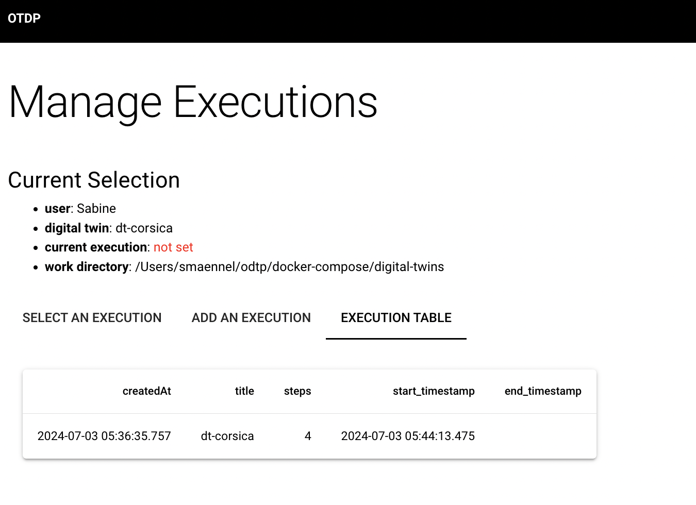
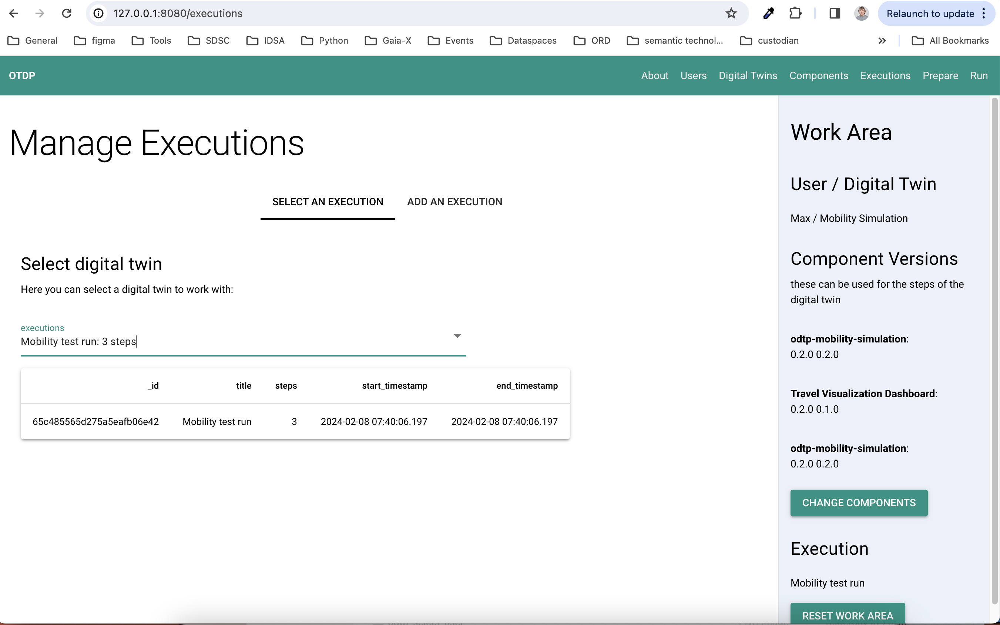
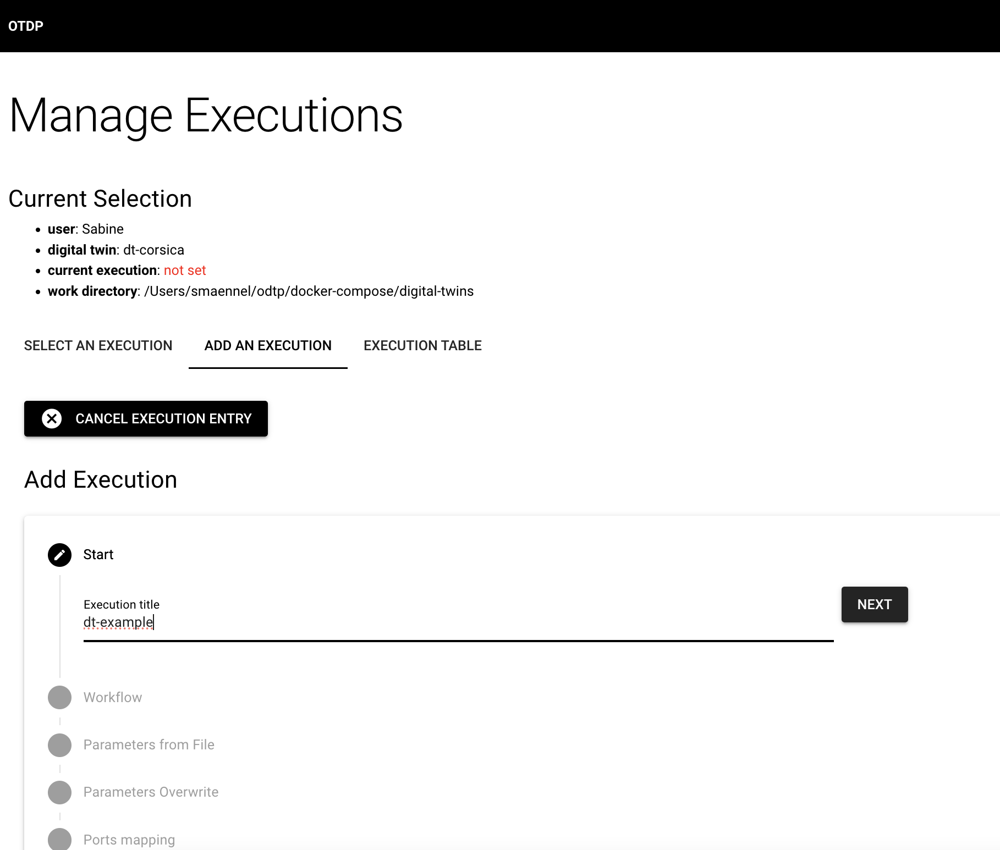
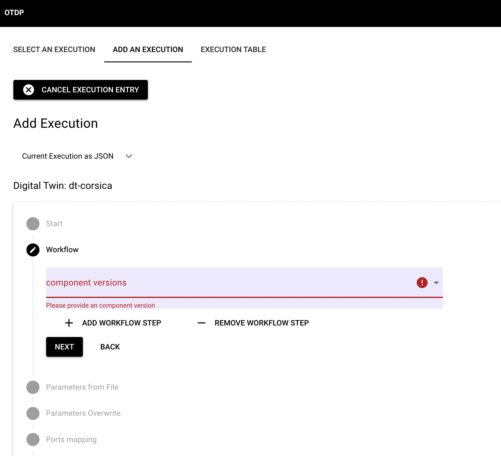
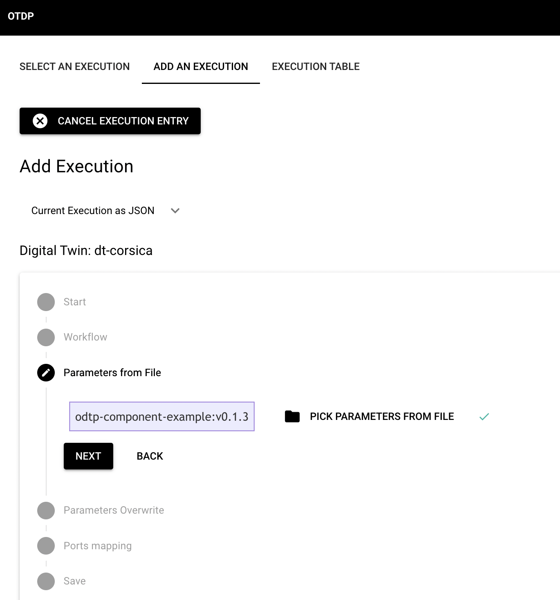
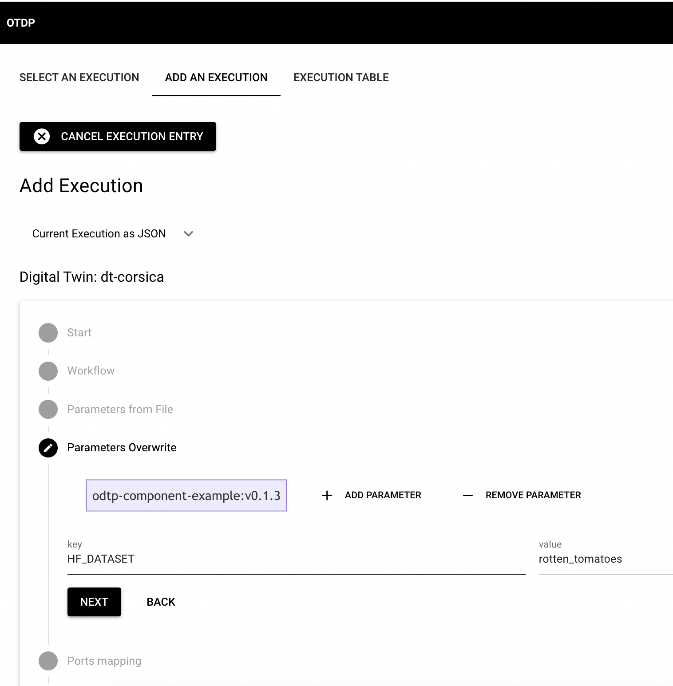
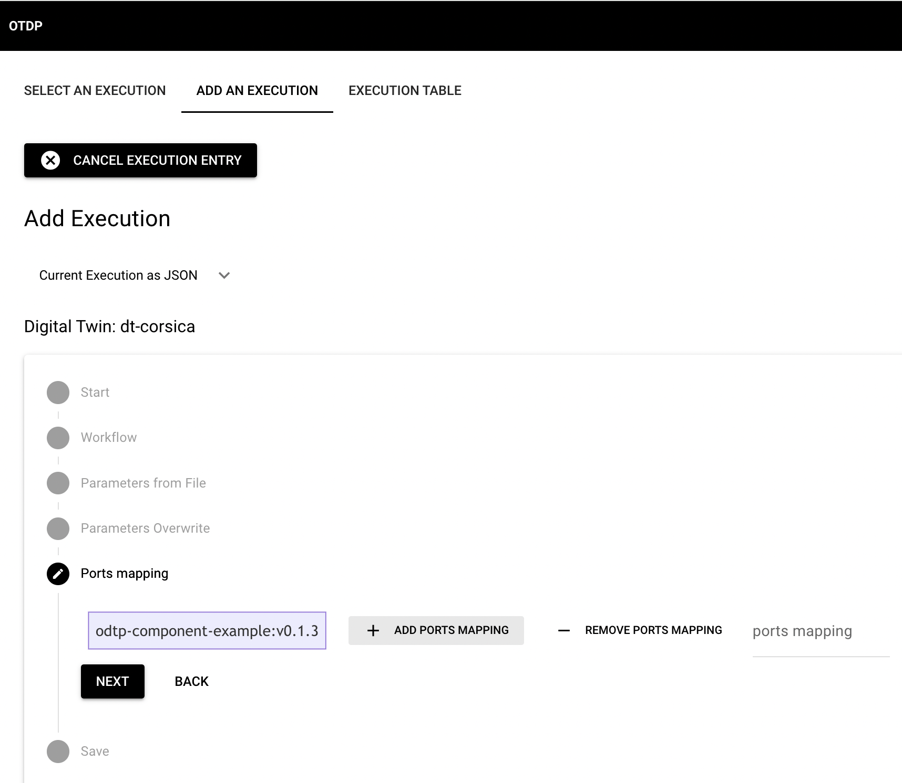
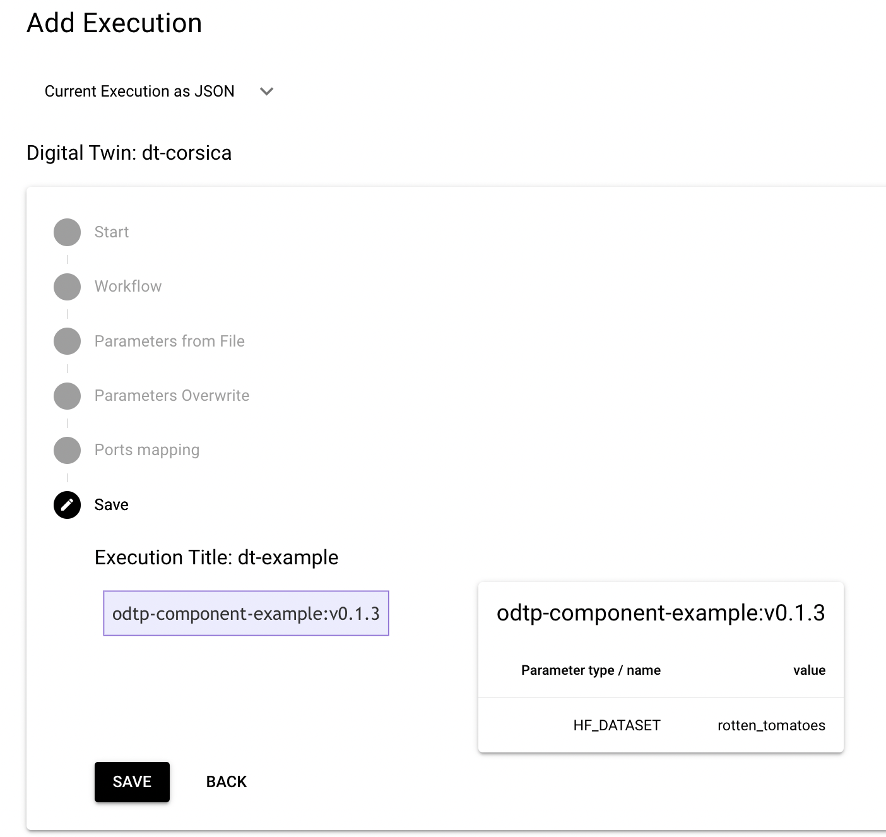

# Executions

!!! note

    - Executions are owned by users and belong to a digital twin
    - Executions consist of components that are run in sequence
    - The output of one component will serve as input to the next component

    ``` mermaid
    graph LR
    component-example_0.1.0 --> travel_dashboard_0.2.1;
    ``` 

On this page you can manage your executions, specify and save them, so that they can be later 
selected for running them.    

## List executions

The Execution page assumes that you have selected both a user and a digital twin to work on.
You can go to the "EXECUTION TABLE" Tab and list all executions that belong to the digital twin

=== "Dashboard GUI"

    In the Dashboard you are guided through the process of creating an execution step by step: 

    { width="800" }

=== "Command Line CLI"

    On the command you can only list all executions in json for a digital twin by running: 

    ```sh
    odtp db executions_for_digitalTwin \
    --dt-id 65c3ab02b4afbca32db08738 
    ```   

## Select execution

Existing executions can be selected in order to run them: when you select an execution you see a 
button: "PREPARE AND RUN EXECUTION": click on it and you will get to a run page where you can run the
execution: see [run executions](run-executions.md)

=== "Dashboard GUI"

    In the Dashboard you are guided through the process of creating an execution step by step: 

    { width="800" }


## Add an execution

An execution consists of components and can have extra port mappings and parameters.

- `digital-twin-id` (Optional): Obtained before. Alternatively, you can use the name of the digital twin. 
- `digital-twin-name` (Optional): Name of the digital twin. Alternatively, you can use the `digital-twin-id`. 
- `name`: A name for the execution
- `component-tags`: All components tags (`componentA:v0.1.0`) involved in the workflow aligned sequentially and separated by commas. 
- `parameter-files`: Parameters files separated by commas.
    - This file should contain all parameters used like in a dotenv file format.
- `ports`: Ports matching used by the containers. 
    - Components ports should be separated by `,`. i.e. `8763:3000,8501:8501`
    - Place as many `,` as connections between components (steps). If ports are not being used in the first, and second component: i.e. `,,8501:8501`
    - If multiple ports are being use in the same step please use `+`: i.e. `,,8501:8501+3000:3000`

In the GUI a form is offered to guide you through the process of specifying all these elements.
In the CLI you have to add all elements yourself: 

In order to better understand these workflows it is best to set up workflow repos as we did in some of our use cases:

- [dt-example workflow](https://github.com/odtp-org/dt-example)
- [dt-corsica-mobility](https://github.com/odtp-org/dt-corsica-mobility)

These repos help you to setup executions in both CLI and the GUI

=== "Dashboard GUI"

    In the Dashboard you are guided through the process of creating an execution step by step: 

    First you need to name your execution:

    { width="800" }

    Select component versions as workflow steps. The components and versions that you can use here must have
    been added at the components page, see [components and versions](components-and-versions.md).

    { width="800" }

    Next you may add parameters from file. In a later step you can also overwrite those initial settings from file.

    { width="800" }

    So here you can overwrite parameters, delete rows or add additional parameters:

    { width="800" }

    Next you need to add port mappings: this is only necessary for persistent components and for the 
    mapping you need to know the component port, that was registered with the component, see 
    [components and versions](components-and-versions.md).

    { width="800" }

    Check your execution and save it if everything is correct. If not, you can walk back through the 
    steps and correct your settings without loosing any information that you already correctly.
    
    { width="800" }
    Once the execution is save you can run it. See above on Selecting an execution.

=== "Command Line CLI"

    A set of parameters is a file containing all the variables needed to run that component. 

    ```
    DATASET=rf3
    CATEGORY=Health
    BATCH_SIZE=100
    ```

    The components tags are formed by component name and version tag from github:

    ```sh
    odtp new execution-entry \
    --digital-twin-name example-workflow \
    --name execution-example \
    --component-tags odtp-dataloader:v1.0.1,odtp-data-dashboard:v1.2.0 \
    --parameter-files /path/params1,path/params2 \
    --ports 80:80,8501:8501+80:80
    ```
    ```
    execution_id: 65c3ab980c57d37eb076b6ba
    step_ids 65c3ab980c57d37eb076b6bb, 65c3ab980c57d37eb076b6bc
    ```

## Prepare and run an execution 

Please refer to section [Run Executions](https://odtp-org.github.io/odtp-manuals/tutorials/run-executions/)

# Delete an execution

Excutions and all associated data, such as MongoDB entries, S3 Files, and project path folders can be easily deleted. In `v0.4.0` this feature is only available in the CLI

=== "Command Line CLI"

    ```sh
    odtp execution delete \
    --execution-name execution-example \
    --project-path /path/exeuction
    ```
