# Executions

!!! note
    - Executions are owned by users and belong to a digital twin
    - Executions build on [Workflows](workflows.md) adding configurations
    - Executions have Steps that correspond to [Component Versions](component-versions.md)
    - The output of one Step will serve as input to the next Step
    - Executions can also be added on the [Commandline](command-line.md#executions)
    - Execution can be created with defaults or they  can be configured. (Defaults are taken from the Workflows)

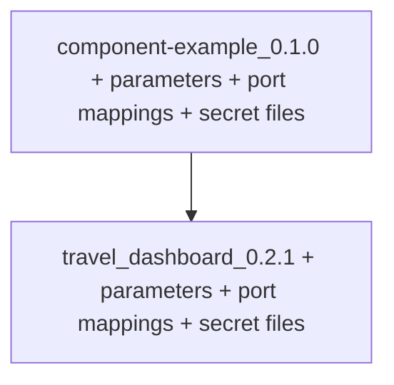

## Add an execution

You can add an execution on the "Add an Execution" tab:

{ width="800" }

An execution has defaults set in the [`odtp.yml` file](../components/odtp-yml.md)

!!! note
    - You can also create the Execution with the defaults and configure it later when you [run](run-executions.md)
    - Or you can configure it during creation: some configurations such as a complete change of [parameters](#parameters) are only possible during the creation of an execution

### Execution with Defaults

The Execution has the defaults already set:

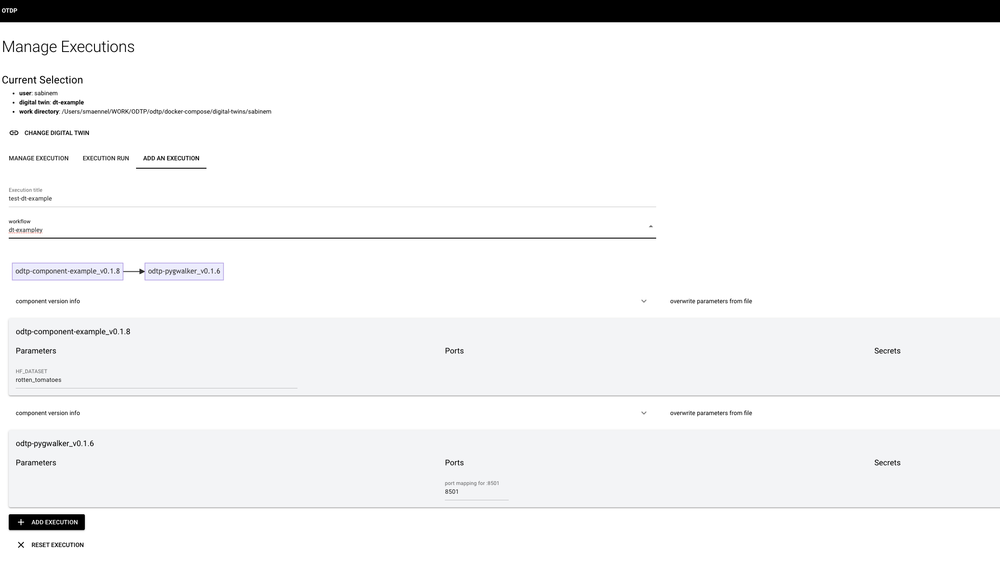{ width="800" }

For each Component Version you can expand the Component Version Info above the Step.

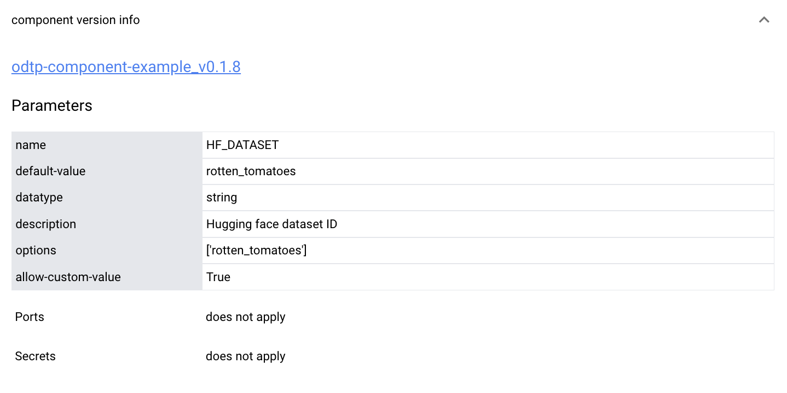{ width="400" }

### Available Configurations

For each Step you can configure:

- [parameters](#parameters)
- [port mappings](#port-mappings)
- [add secret files](#secrets-files)

#### Parameters

You can upload parameters from a file: this will overwrite the existing parameters with out additional checks. The upload area need to be expanded above the Step on the right.

!!! note
    - Parameter uploads are only offered when you create the Execution
    - When you run the Execution you can only overwrite the existing parameters

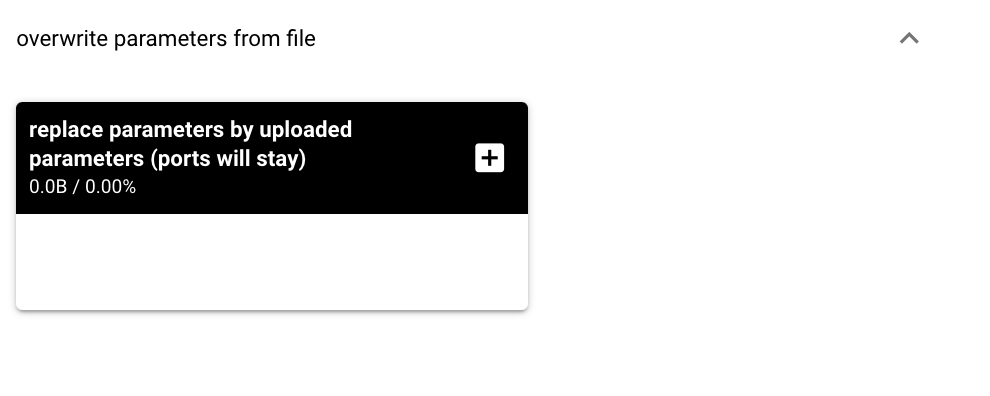{ width="400" }

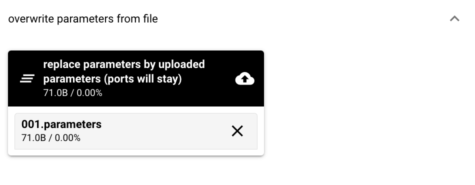{ width="400" }

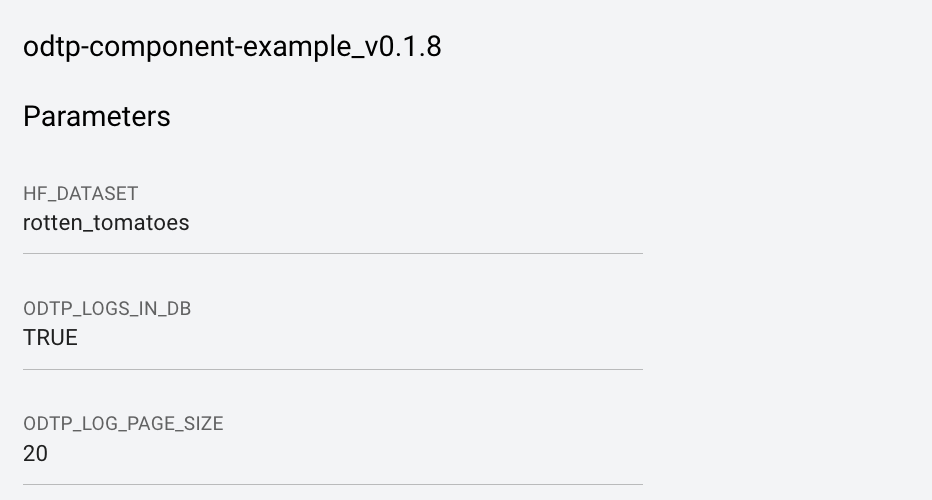{ width="400" }

#### Port Mappings

You can overwrite port mappings

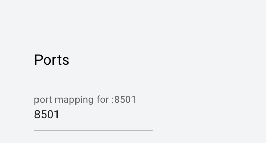{ width="400" }

#### Secrets Files

In case Secrets are needed you are offered a selection of your uploaded encrypted secrets file. If you don't have them uploaded yet, see [how to uploaded encrypted secrets files](users.md#upload-secrets).

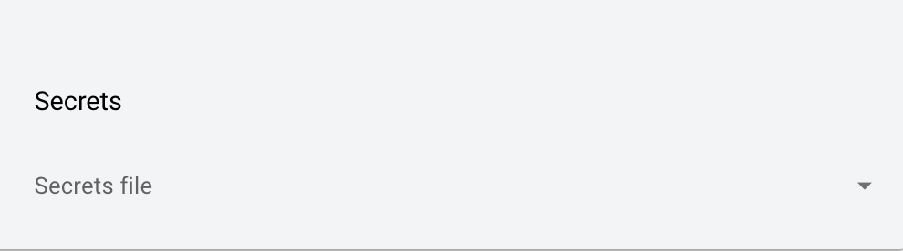{ width="400" }

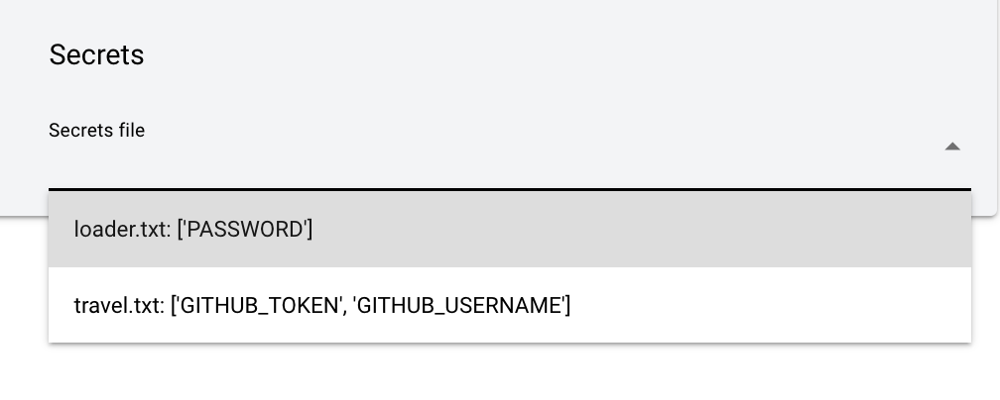{ width="400" }

### Save Execution

Don't forget to save the execution by clicking on "Save Execution". Alternatively you can also clear the screen and click on "Reset Execution".

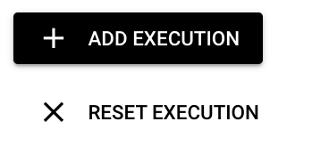{ width="200" }

## Manage Executions

The Execution page assumes that you have selected both a user and a digital twin to work on.

In the Dashboard you can list all Executions of your selected Digital Twin.

* you can deprecate Executions
* you can also reactivate them
* you can chose to also show deprecated Executions. By default they are not displayed

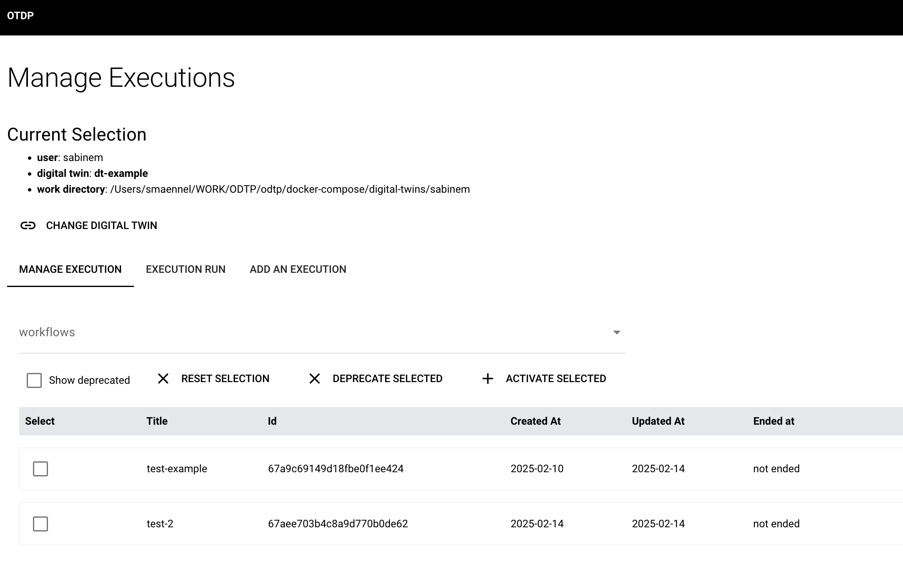{ width="800" }

## Next Run Execution

Once you have added an Execution you can run it:

[Run Executions](run-executions.md){ .md-button }
