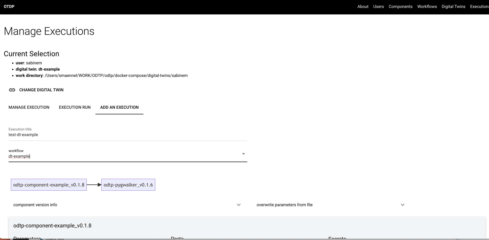
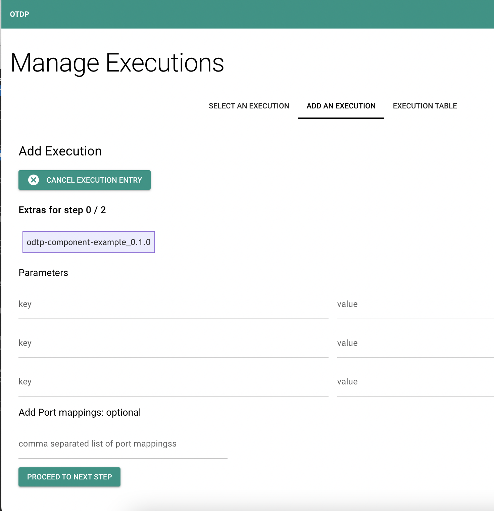
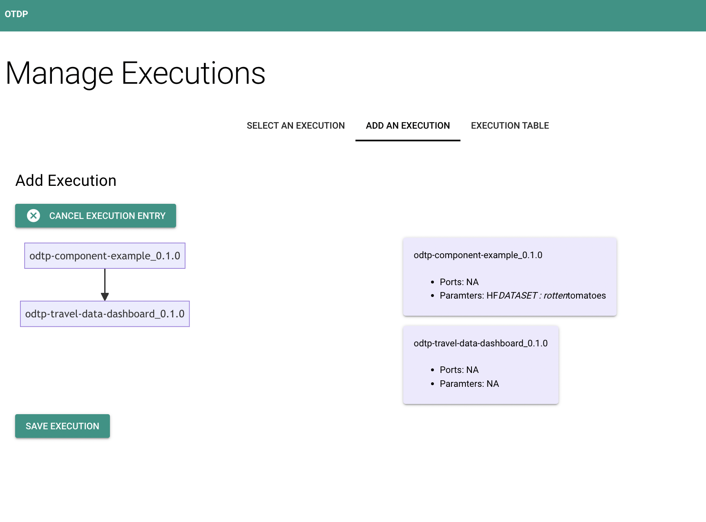

# Executions

!!! note

    - Executions are owned by users and belong to a digital twin
    - Executions consist of components that are run in sequence
    - The output of one component will serve as input to the next component

    ``` mermaid
    graph LR
    component-example_0.1.0 --> travel_dashboard_0.2.1;
    ``` 

## Add an execution

An execution consists of components and can have extra port mappings and parameters.

- `digital-twin-id`: Obtained before. 
- `name`: A name for the execution
- `versions`: All versions involved in the workflow aligned sequentially and separated by commas. 
    - Versions order should match components. 
- `parameter-files`: Parameters files separated by commas.
    - This file should contain all parameters used like in a dotenv file format.
- `ports`: Ports matching used by the containers. 
    - Components ports should be separated by `+`. i.e. `8763:3000+8501:8501`
    - Place as many `+` as connections between components. If ports are not being used in the first, and second component: i.e. `++8501:8501`


=== "Dashboard GUI"

    First you need to collect components for your execution and give it a name 

    { width="800" }

    Then you may add paramters and ports: those are optional

    { width="800" }

    You will see your executution, now you can save it.

    { width="800" }

=== "Command Line CLI"

    A set of parameters is a `dotenv` file containing all the variables needed to run that component. 

    ```sh
    odtp new execution-entry \
    --digital-twin-id 65c36638f20bedbcd253df34 \
    --name execution-example \
    --component-versions 65c36599a95e22284b07e824,65c365a9e94d273db99b6ced \
    --parameter-files /path/params,path/params \
    --ports 80:80,8501:8501+80:80
    ```
    ```
    execution_id: 65c3ab980c57d37eb076b6ba
    step_ids 65c3ab980c57d37eb076b6bb, 65c3ab980c57d37eb076b6bc
    ```

<script src="https://hypothes.is/embed.js" async></script>
