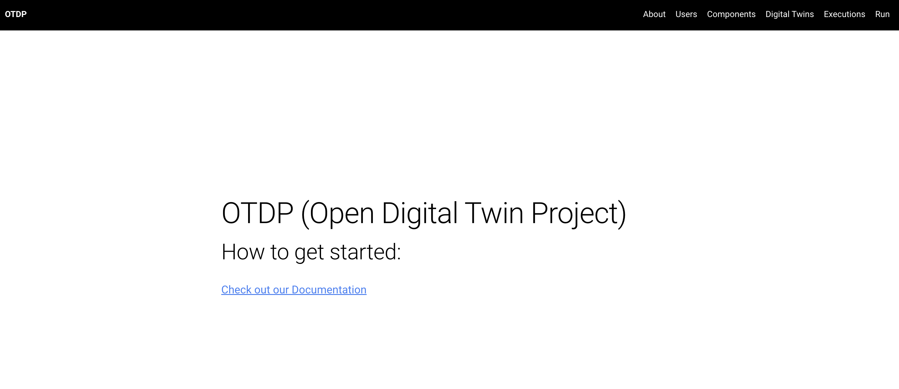

# Getting started

This tutorial will guide you through setting up a digital twin and running it

## Start

=== "Dashboard GUI"

    If you are using poetry, you can go to `odtp` folder and run `poetry shell`. This will load the enviroment with all dependencies.

    On the other hand, if you are using the `docker-compose` solution you can just run `odtp` command directly.

    ``` sh
    odtp dashboard
    ```

=== "Command Line CLI"

    If you are using poetry, you can go to `odtp` folder and run `poetry shell`. This will load the enviroment with all dependencies.

    On the other hand, if you are using the `docker-compose` solution you can just run `odtp` command directly.

    ``` sh
    odtp --help
    ```

## Now the interface should be up

So you can start working:    

=== "Dashboard GUI"

    { width="800" }

=== "Command Line CLI"

    { width="800" }

Checkout the following topis:

-  [add users and digital twins](tutorials/users-and-digital-twins)
-  [add components and versions](tutorials/components-and-versions)
-  [add executions](tutorials/executions)
-  [run executions](tutorials/run-executions)

<script src="https://hypothes.is/embed.js" async></script>
