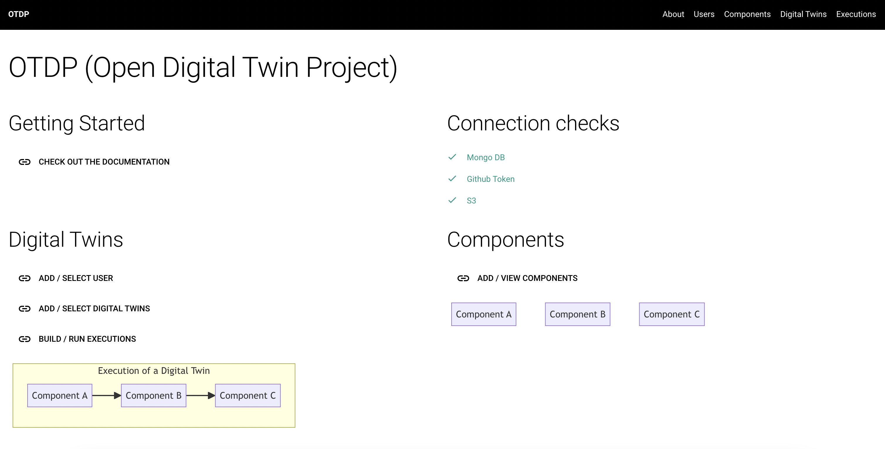

# Getting started

This tutorial will guide you through setting up a digital twin and running it

## Start

=== "Dashboard GUI"

    ``` sh
    # go to the project folder
    poetry shell
    ```

=== "Command Line CLI"

    ``` sh
    # go to the project folder
    poetry shell
    odtp dashboard
    ```

## Now the interface should be up

So you can start working:    

=== "Dashboard GUI"

    { width="800" }

=== "Command Line CLI"

    { width="800" }

Checkout the following topis:

-  [add users and digital twins](../users-and-digital-twins)
-  [add components and versions](../components-and-versions)
-  [add users and digital twins](../executions)
