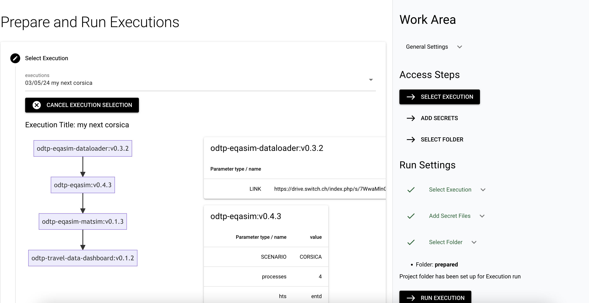
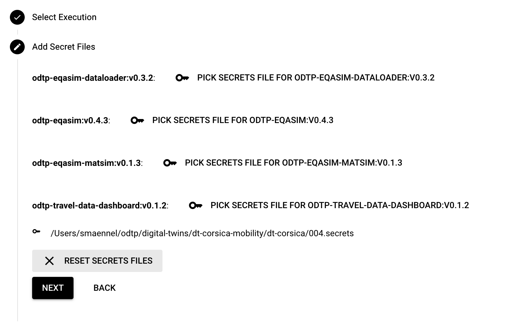
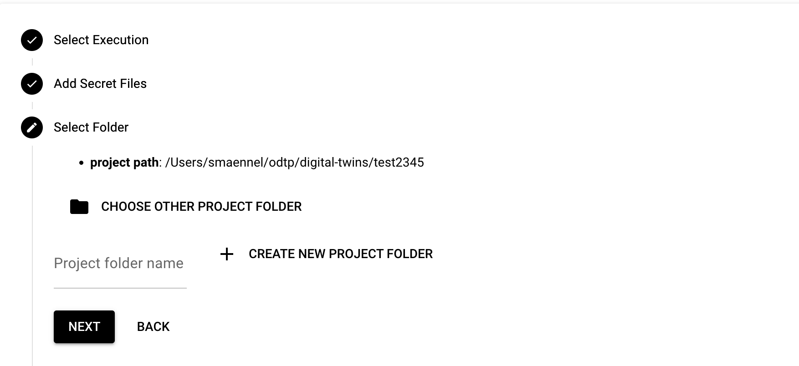

# Run Executions

!!! note

    - Executions can be run on your local computer
    - Executions need to be prepared before they can run
    - Start with an empty folder on your local computer

    ``` mermaid
    graph LR
    component-example_0.1.0 --> travel_dashboard_0.2.1;
    ``` 

## Run an execution

To run an execution you need to go through the following steps:

- Prepare for the execution
- Run the execution

### Prepare for the execution

- in this step a folder structure will be established in an empty project folder on your local computer
- the docker images for the components will be build

=== "Dashboard GUI"

    First you have to select the execution, then you may add secrets. You also need to setup a project folder that needs to be empty at the start.

    { width="800" }

    { width="800" } 

    { width="800" }

=== "Command Line CLI"

    Prepare the execution. 

    ``` sh
    odtp execution prepare \
    --execution-name my-example-execution \
    --project-path [Project path]
    ```

    A normal preparation looks like this:

    ``` sh
    INFO (21/12/2023 02:53:02 PM): Connected to: <odtp.db.MongoManager object at 0x138546950> (LineL 22 [initial_setup.py])
    INFO (21/12/2023 02:53:03 PM): Connected to: <odtp.db.MongoManager object at 0x12eca4110> (LineL 22 [initial_setup.py])
    INFO (21/12/2023 02:53:03 PM): Connected to: <odtp.db.MongoManager object at 0x138530bd0> (LineL 22 [initial_setup.py])
    INFO (21/12/2023 02:53:04 PM): Removing all files and directories (LineL 23 [run.py])
    INFO (21/12/2023 02:53:04 PM): Downloading repository from https://github.com/odtp-org/odtp-component-example to dt_test/component-example_0.0.1_0/repository (LineL 35 [run.py])
    Cloning into 'dt_test/component-example_0.0.1_0/repository'...
    remote: Enumerating objects: 65, done.
    remote: Counting objects: 100% (65/65), done.
    remote: Compressing objects: 100% (42/42), done.
    remote: Total 65 (delta 30), reused 52 (delta 18), pack-reused 0
    Receiving objects: 100% (65/65), 31.23 KiB | 376.00 KiB/s, done.
    Resolving deltas: 100% (30/30), done.
    INFO (21/12/2023 02:53:05 PM): Building Docker image component-example_0.0.1 from dt_test/component-example_0.0.1_0/repository (LineL 47 [run.py])

    INFO (21/12/2023 03:24:36 PM): COMPONENTS DOWNLOADES AND BUILT (LineL 60 [workflow.py])
    ```

### Run the execution   

In this step the docker container for the components will run and produce the actual output.

=== "Dashboard GUI"
    
    { width="800" }

=== "Command Line CLI"

    Run the execution

    ``` sh
    odtp execution prepare \
    --execution-name my-example-execution \
    --project-path 
    ```
