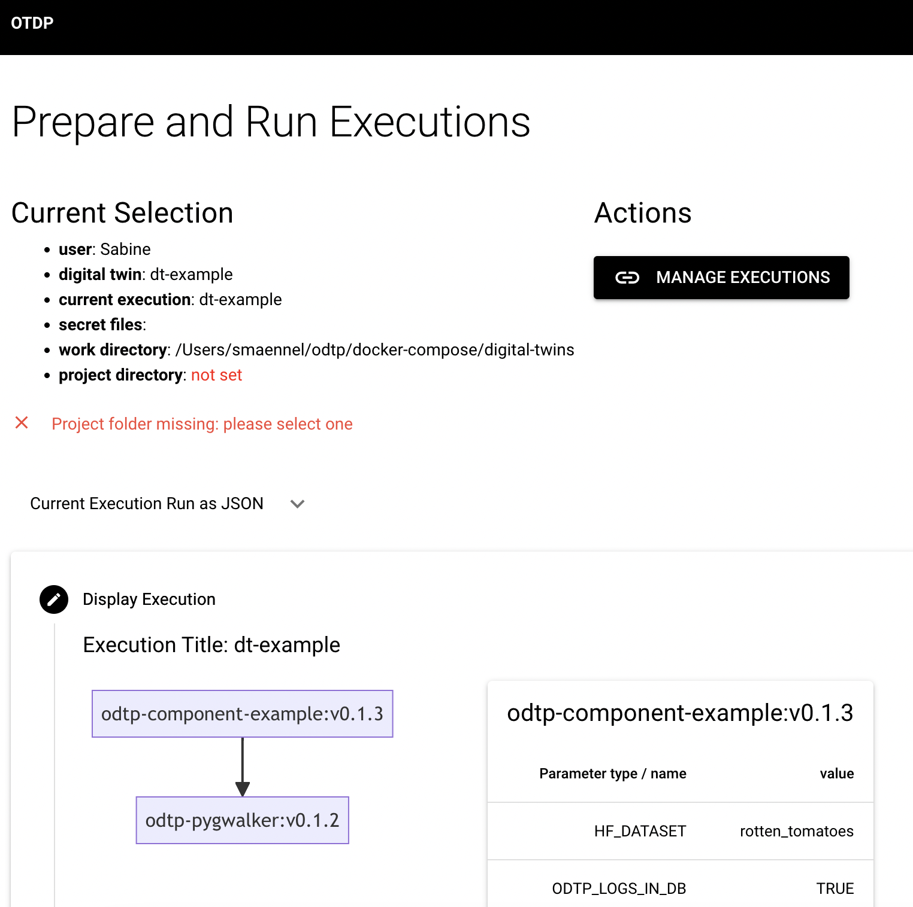
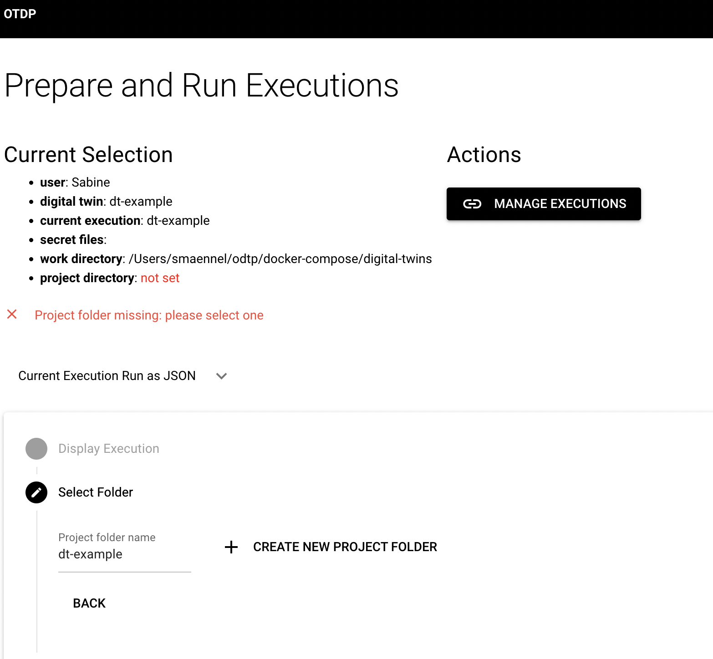
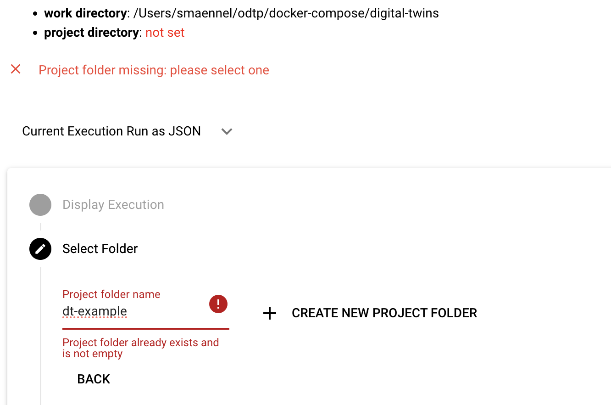
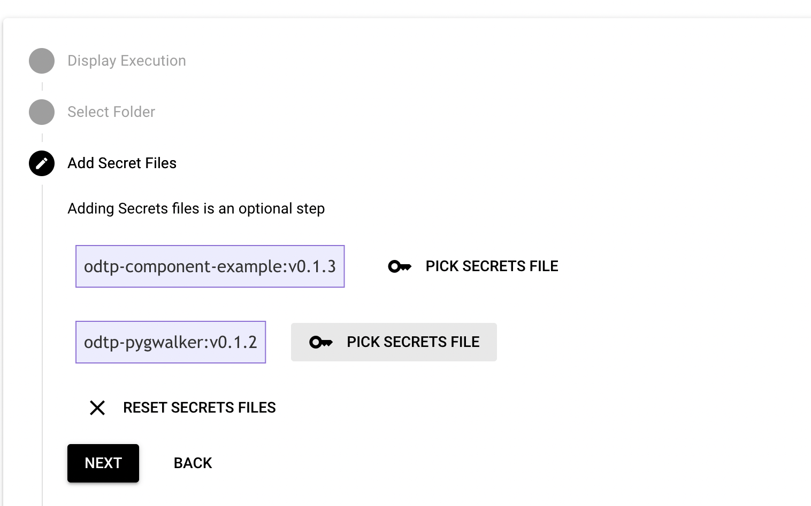
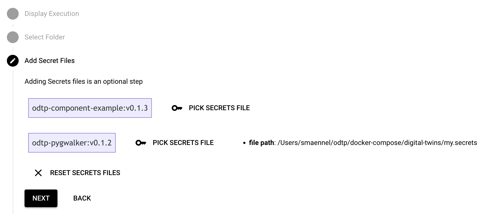
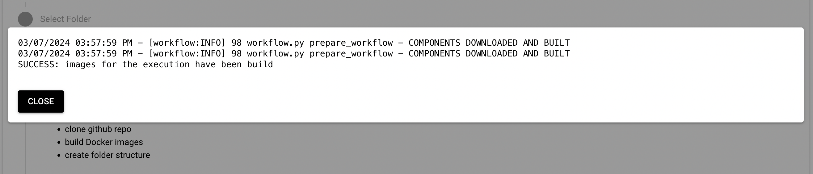
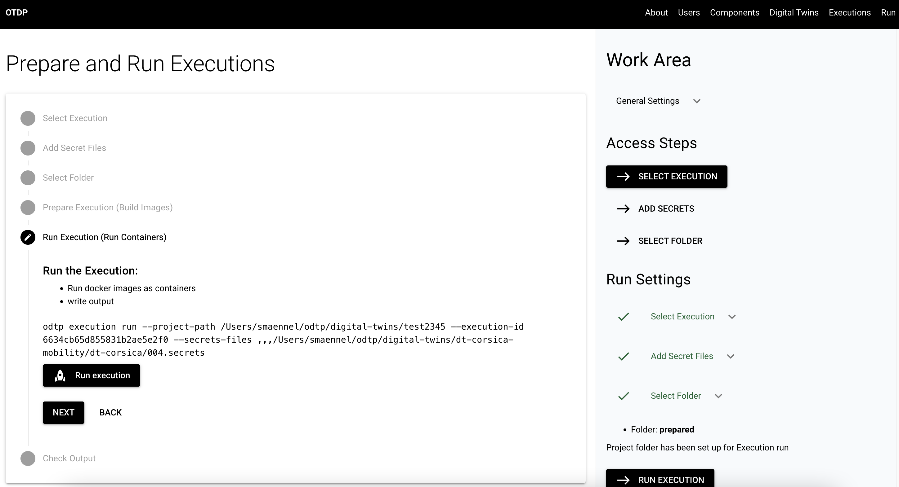
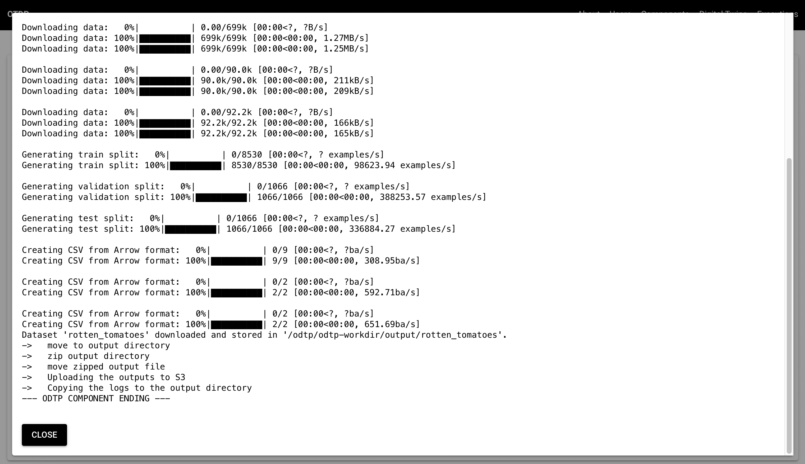

# Run Executions

!!! note

    - Executions can be run on your local computer
    - Executions need to be prepared before they can run
    - Start with an empty folder on your local computer

    ``` mermaid
    graph LR
    component-example_0.1.0 --> travel_dashboard_0.2.1;
    ``` 

## Explain the Execution Run

To run an execution you need to go through the following steps:

### Prepare => Docker Build, Prepare File System

- in this step a folder structure will be established in an empty project folder on your local computer and the repository will be downloaded into it. Also folders for logs, input and output will be created
- for all components it is checked whether docker images already exist, otherwise they will be build: As the settings are added only when the execution is run, images for components can be reused as long as the component version does not change. In case of a version change on the component all existing docker images for that component should be deleted. 
     

### Run => Docker Run

- the docker containers for the components will run in sequence as specified in the workflow
- Only when the execution runs all parameters, secrets, volumes and port mapping are needed. Except for the secrets and the project folder they are taken from the execution as it is stored in the mongo db.

## Run the execution in practice

### Prepare the Execution CLI/GUI

=== "Dashboard GUI"

    As most arguments that are needed for the execution run are stored in the mongo db only the project folder and secrets if needed have to be added. The GUI takes you through the process step by step. You enter the execution run page with an execution that has already been selected. You first task is to check whether it has all parameters and ports setup correctly. For that the execution is displayed again on the run page: 
    { width="800" }

    You can see that the project path has not been set yet: so in the first step you need to choose the project path by creating a new project folder:

    { width="800" } 

    Don't worry: it will tell you in case the project folder already exists:

    { width="800" }

    The next step is optional: only if your components needs secrets such as for example github credential, then you need to add the secrets as a file. This might be the case if your tool is in a private repository.

    { width="800" }

    { width="800" }

    Now you are ready to prepare your execution: 

    { width="800" }

    Once you click the button the log will open:

    { width="800" }

    There will be a success message at the end of the log file indicating that all docker images have been build. 
    Then you will be able to click the "NEXT" button to proceed to the run step.

=== "Command Line CLI"

    Prepare the execution. This will generate all the folder structure and build all necesary docker images for our digital twin. From `v0.4.0` odtp will check for available images before building, if no image is available then the repository will be pulled and the docker image will be built. 

    An empty folder must be provided to generate the data folder required, and we recommend placing it in a preconfigured digital twin folder. 

    ``` sh
    odtp execution prepare \
    --execution-name execution-example \
    --project-path /path/execution
    ```

    A normal preparation looks like this:

    ``` sh
    INFO (21/12/2023 02:53:02 PM): Connected to: <odtp.db.MongoManager object at 0x138546950> (LineL 22 [initial_setup.py])
    INFO (21/12/2023 02:53:03 PM): Connected to: <odtp.db.MongoManager object at 0x12eca4110> (LineL 22 [initial_setup.py])
    INFO (21/12/2023 02:53:03 PM): Connected to: <odtp.db.MongoManager object at 0x138530bd0> (LineL 22 [initial_setup.py])
    INFO (21/12/2023 02:53:04 PM): Removing all files and directories (LineL 23 [run.py])
    INFO (21/12/2023 02:53:04 PM): Downloading repository from https://github.com/odtp-org/odtp-component-example to dt_test/component-example_0.0.1_0/repository (LineL 35 [run.py])
    Cloning into 'dt_test/component-example_0.0.1_0/repository'...
    remote: Enumerating objects: 65, done.
    remote: Counting objects: 100% (65/65), done.
    remote: Compressing objects: 100% (42/42), done.
    remote: Total 65 (delta 30), reused 52 (delta 18), pack-reused 0
    Receiving objects: 100% (65/65), 31.23 KiB | 376.00 KiB/s, done.
    Resolving deltas: 100% (30/30), done.
    INFO (21/12/2023 02:53:05 PM): Building Docker image component-example_0.0.1 from dt_test/component-example_0.0.1_0/repository (LineL 47 [run.py])

    INFO (21/12/2023 03:24:36 PM): COMPONENTS DOWNLOADES AND BUILT (LineL 60 [workflow.py])
    ```

### Run the Execution CLI/GUI  

In this step the docker container for the components will run and produce logs and output. For this step it is essential that all parameters and ports have been set correctly and also that secrets files have been selected, in case the secrets will be needed during the execution of the components.

=== "Dashboard GUI"

    Click on the button "RUN EXECUTION" to start a run. You will see a message indicating that the run started. After that click on the Log Button for the first step. The log will open and you can follow the execution run directly from the GUI. The messages that you will see are also stored on file in the logs directory `odtp-logs`, which is a subdirectory of the project folder: there is one logs directory for each component in your execution. The logs are also identical with what you would see in your docker container as long as it runs.

    { width="800" }
    { width="800" }

    For ephemeral components will be a line at the end of each log, indicating that the component ended the run. 
    For persistent components that line will not be there as they did not end but the docker container should remain
    up until shut down manually by the user.

=== "Command Line CLI"

    Once your execution is prepared, it's time to run it! When running an execution you can provide some secrets for your components separated by commas (`,`) similar to how you define the pipeline in the execution generation. Secrets files are structure in a similar way to parameters files described in [Executions](https://odtp-org.github.io/odtp-manuals/tutorials/executions/#__tabbed_3_2)

    ``` sh
    odtp execution run \
    --execution-name execution-example \
    --secrets-files /path/Secrets001,/path/Secrets001 \
    --project-path /path/execution
    ```
