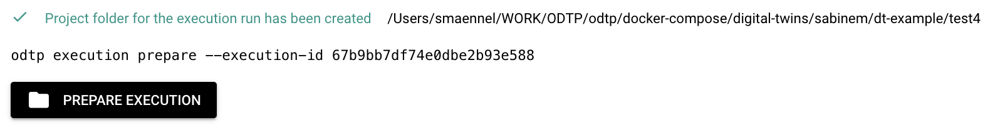
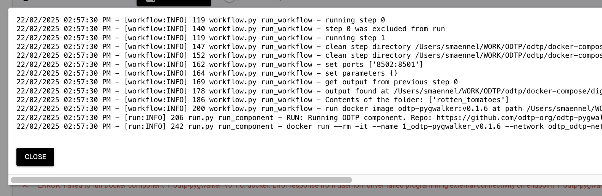

# Run Executions

!!! note
    - Run Executions by selecting them
    - Partial runs of executions are possible
    - You can also run executions via the [commandline](command-line.md#run-executions)

Go to the tab "Execution Run".

## Select an Execution for Run

Select a new execution for a run and you will see how it has been set up in each step:

* parameters
* port mappings
* secret files

{ width="800" }

{ width="800" }

## Step 1: Adapt Configuration

You can still overwrite the configuration:

### Overwrite Parameter Values

You can overwrite the parameter values, but not [upload parameters from file](executions.md#parameters) as when an execution is created

{ width="400" }

### Overwrite Port Mappings

You can overwrite port mappings

{ width="400" }

### Select Secrets Files

You can select files with the secrets that the step need [similar to when the execution is created](executions.md#secrets-files)

{ width="400" }

## Step 3: Create Execution Directory

Next you need to create an execution directory by clicking on the button at the bottom of the page: "Create Project Directory"

{ width="200" }

You will see a new button "Prepare Execution" appear.

## Step 4: Prepare the Execution

{ width="800" }

Click on the button and it will start to build the images. When possible previously build images will be reused. You will see the terminal output in a window.

{ width="800" }

Once the images have been build you will see a new button "Run execution" appear.

## Step 5: Run Execution

{ width="800" }

Again you will see the terminal output in a window: in the example below the component run failed.

{ width="800" }

Once you close the terminal window, you will also be able to see the error on the execution run page.

{ width="800" }
{ width="400" }

## Step 6 (Optional) Rerun a Step

In case a Step failed to run you can make correction and switch a flag to rerun the Step.

{ width="400" }
{ width="800" }
{ width="800" }

Interactive Components stay running, so in that case you won't see a success message in the terminal output window. You may also take a look on docker to see what is happening:

{ width="800" }

Since the Step is running as a container, we can close the Terminal output window and take a look on the page again:

## Step 7 Check the logs

Each step may have a button to check the logs.

{ width="800" }

Typical log of an ephermeral Step: the Component ran and ended.

{ width="800" }

Typical log of an interactive Step: the application started and is served.

{ width="800" }
