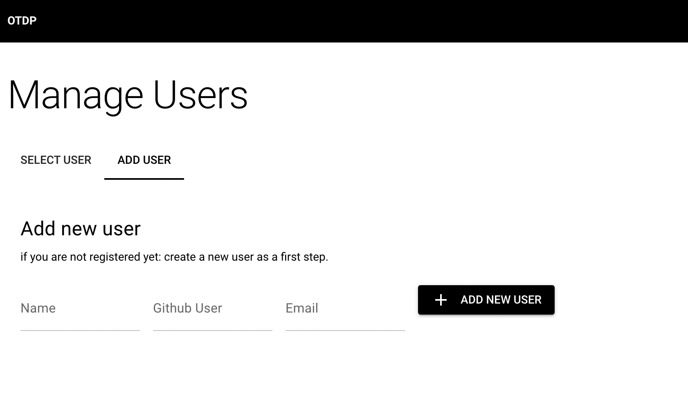
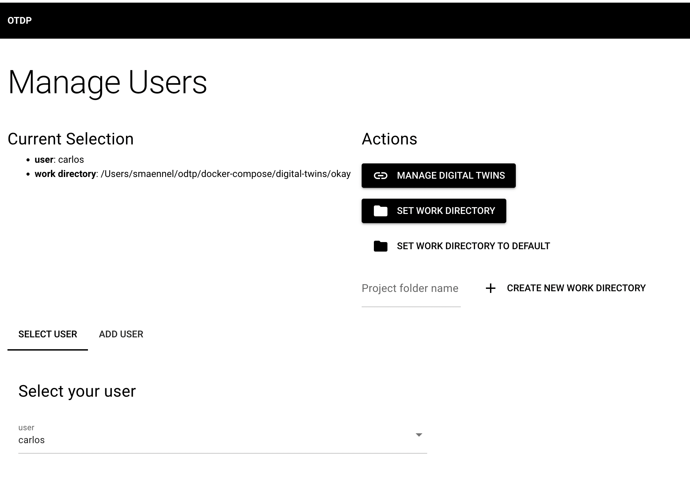
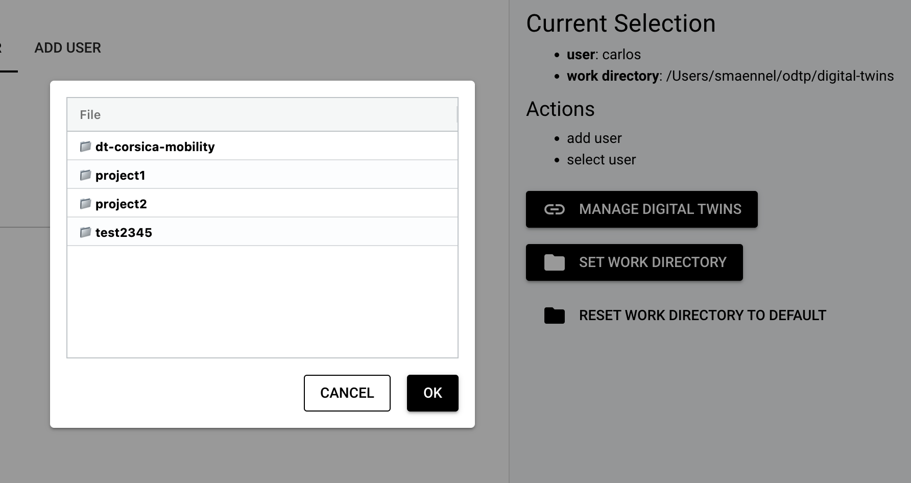
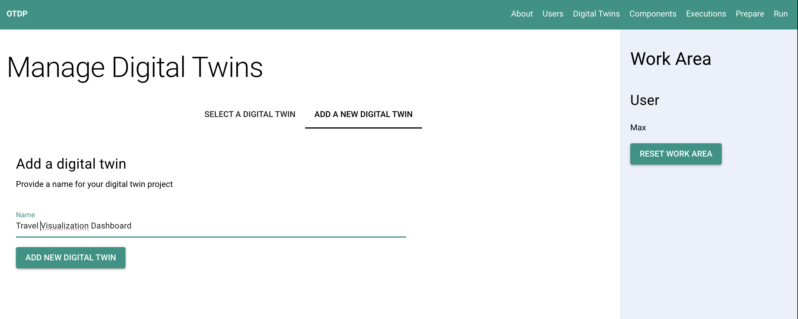
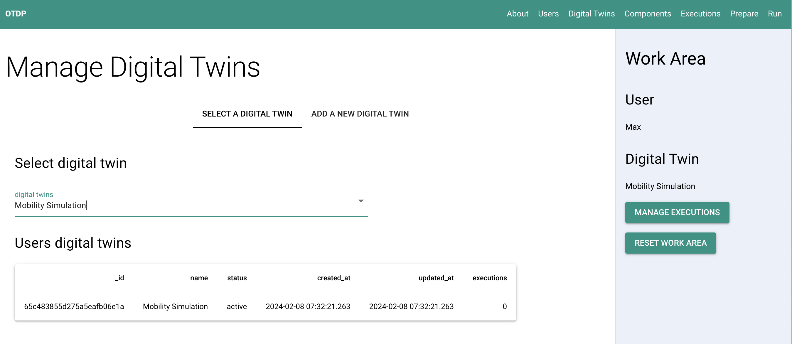

# Users and digital twins

!!! note

    Digital Twins are owned by users (at least for now)

## Setup a user

So the first thing you need is a user:

=== "Dashboard GUI"

    { width="800" }
    { width="800" }

    In the Dashboard you can additionally to managing users also choose a working directory. A default
    directory will have been preselected, but you can refine that setting:

    { width="800" }


=== "Command Line CLI"

    ``` sh
    odtp new user-entry \
    --name Max \
    --email max@mail.com \
    --github max
    ```
    
    The output should looks like: 
    ```
    A user has been added: 65c3ab02b4afbca32db08738
    ``` 


## Setup a digital twin project

Once you have a user, you can set up a digital twin


=== "Dashboard GUI"

    { width="800" }
    { width="800" }

=== "Command Line CLI"

    In the CLI you need the `user-id` from the previous step: 

    ```sh
    odtp new digital-twin-entry \
    --user-id 65c3ab02b4afbca32db08738 \
    --name example 
    ```

    You can also use the user email to identify the user, that the digital twin belongs to

    ```sh
    odtp new digital-twin-entry \
    --user-email max@mail.com \
    --name example 
    ```

    The output should looks like: 
    ```
    A digital twin has been added: 65a7c735732ae1d3fee2b946
    ``` 
