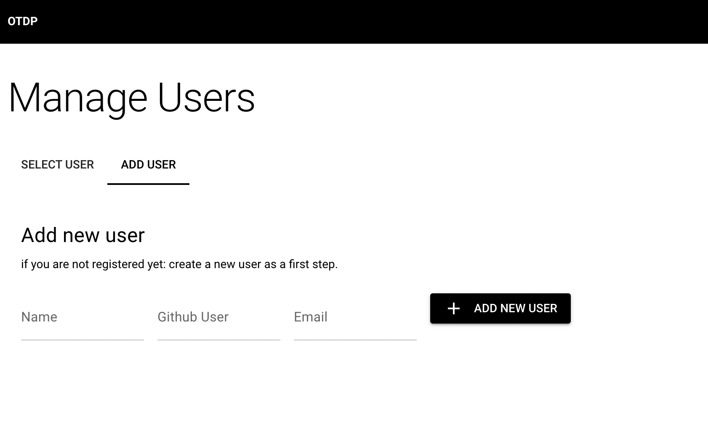
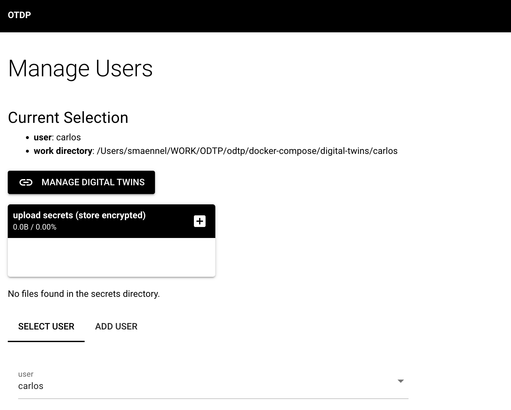
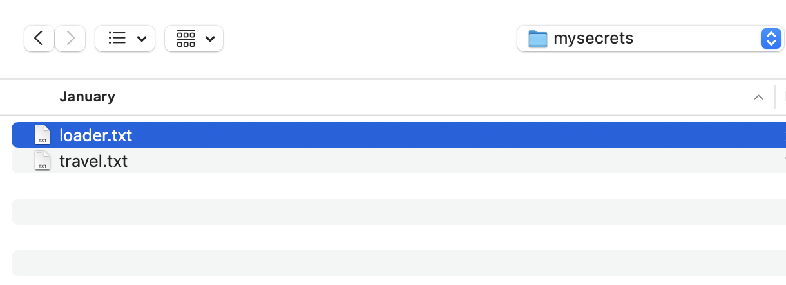
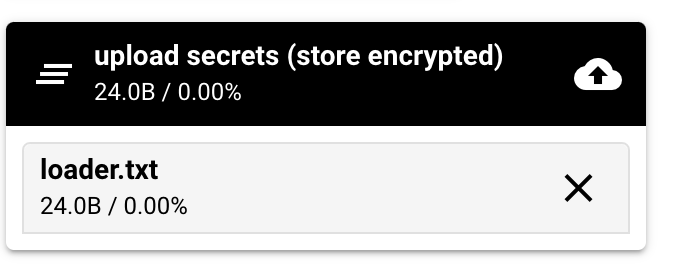
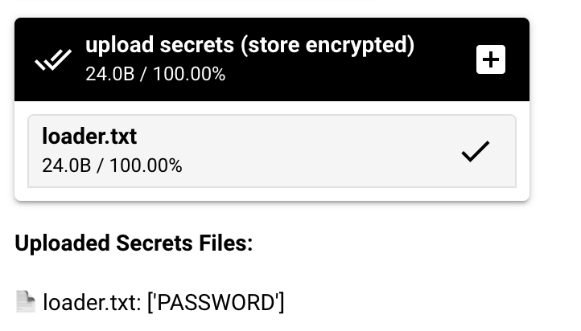
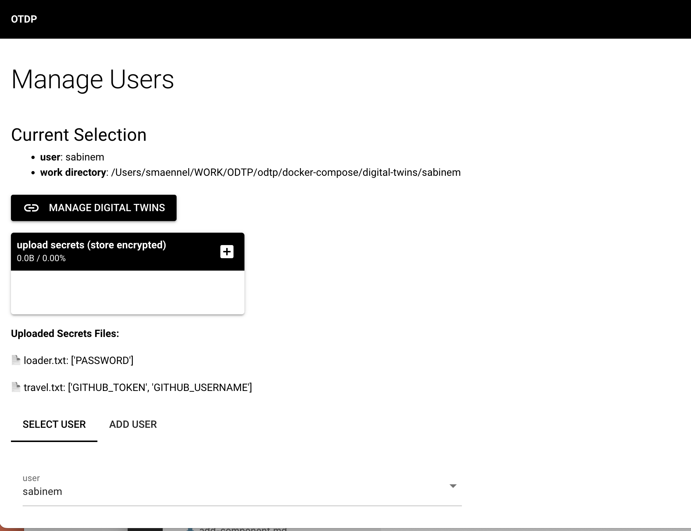

# Users

!!! note
    * The username has to be unique and the github user has to exist.
    * Users can also be added via the [Commandline](command-line.md#users)

## Setup a user

So the first thing you need is a user:

{ width="800" }

## Select a User

As a next step you can select the user and add additional information:

{ width="800" }

## Upload Secrets

You can upload named files with secrets.

!!! note
    * The secret files are stored encrypted on the server.
    * Once you uploaded secrets the application will test whether it can do the encryption and
    show you the keys that are stored in the file.

{ width="400" }

{ width="400" }

{ width="400" }

{ width="800" }

## Add a Digital Twin

Once you have a user, you can set up a Digital Twin.

[Digital Twins](digital-twins.md){ .md-button }
