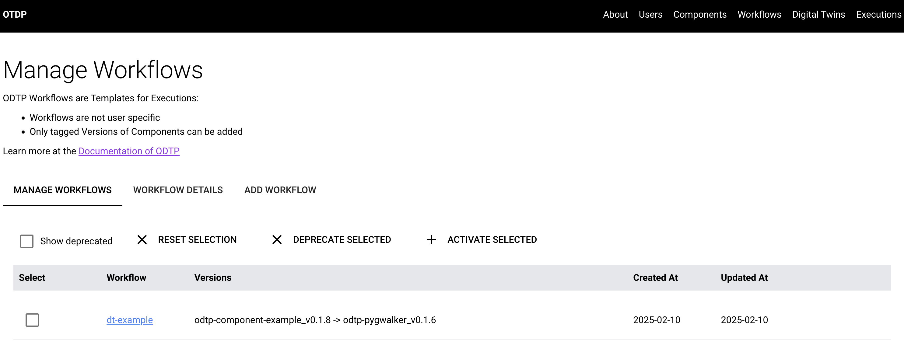
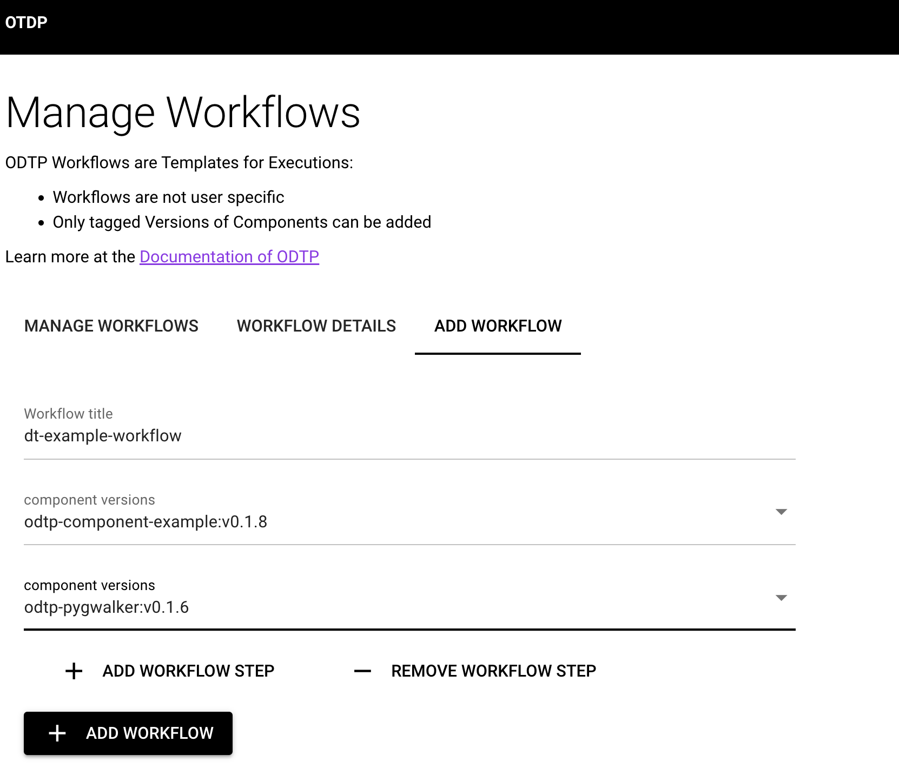
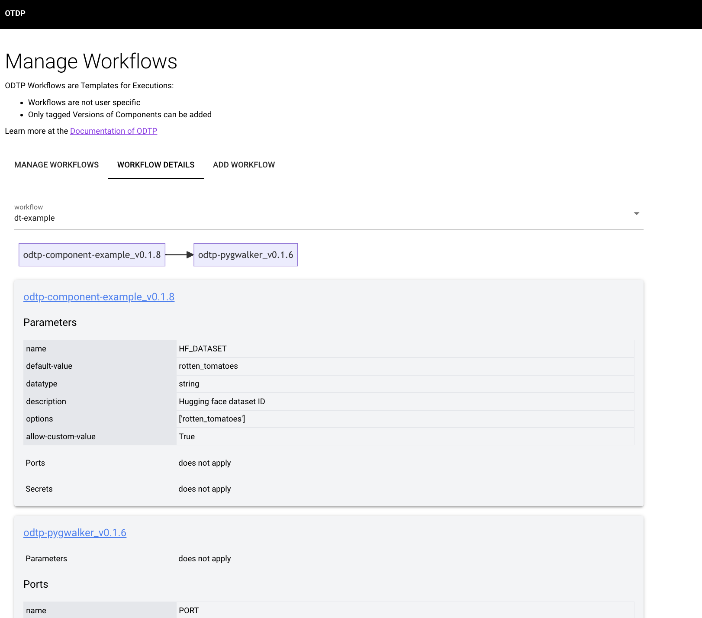

# Workflows

!!! note
    * in the CLI workflows are added automatically when executions are added
    * workflows are templates for executions that determine the sequence of Component Versions to be run, without yet specifying the parameters or run time
    * workflows are shared between users and not owned by users

## Manage Workflows

In the Dashboard you can list all Workflows that are already on ODTP.

* you can deprecate Workflows
* you can also reactivate them
* you can chose to also show deprecated Workflows. By default they are not displayed

{ width="800" }

## Add a Workflow

In the GUI you need to define workflows before you can add executions. In the CLI workflows will be added automatically when you add an execution.

{ width="400" }

## Workflow Details

You can view the workflow with its components on the Workflow detail tab:

{ width="800" }

## Next add Executions

A Workflow is the template for executions: Executions are Workflows with added configurations and actual runs. So once you have added a workflow, you can Executions for it:

[Executions](executions.md){ .md-button }
