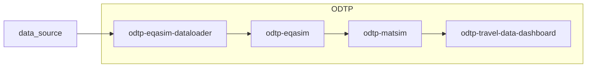
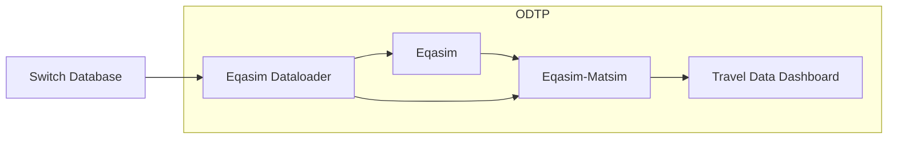

# Eqasim and Matsim simulations

## Description

Digital Twin involving Mobility Simulation of three scenarios: `Ile de France`, `Corsica`, and `Switzerland`. 

## Digital Twin Workflow

This workflow involves 4 components:

- [odtp-eqasim-dataloader](https://github.com/odtp-org/odtp-eqasim-dataloader): The data loader component prepares statistical data on the population of the respective scenario and the geographic data from standardized data sources. 
- [odtp-eqasim](https://github.com/odtp-org/odtp-eqasim): The eqasim component generates a synthetic population based on statistical data and links them with travel profiles according to statistical properties.
- [odtp-eqasim-matsim](https://github.com/odtp-org/odtp-matsim): The MATSim component uses the synthetic population to generate transport simulations.
- [odtp-travel-data-dashboard](https://github.com/odtp-org/odtp-travel-data-dashboard): The travel data dashboard visualizes the Origin-Destination data output of the MATSim simulation to communicate mobility patterns.

## Corsica Use Case

!!! Note
    The Corsica workflow repo is still under construction and is not yet public 

As the data for the corsica use case is open data, there is also a repo sharing its workflow: [Corsica Workflow and Tutorial](https://github.com/odtp-org/dt-corsica-mobility)

## Reference and contact

- [CSFM](https://csfm.ethz.ch/en/) or [SDSC](https://www.datascience.ch/)
- The French scenario are publicly available, the Swiss scenario requires a valid contract with the [Swiss Federal Statistics Office FSO](https://www.bfs.admin.ch/bfs/en/home.html).
